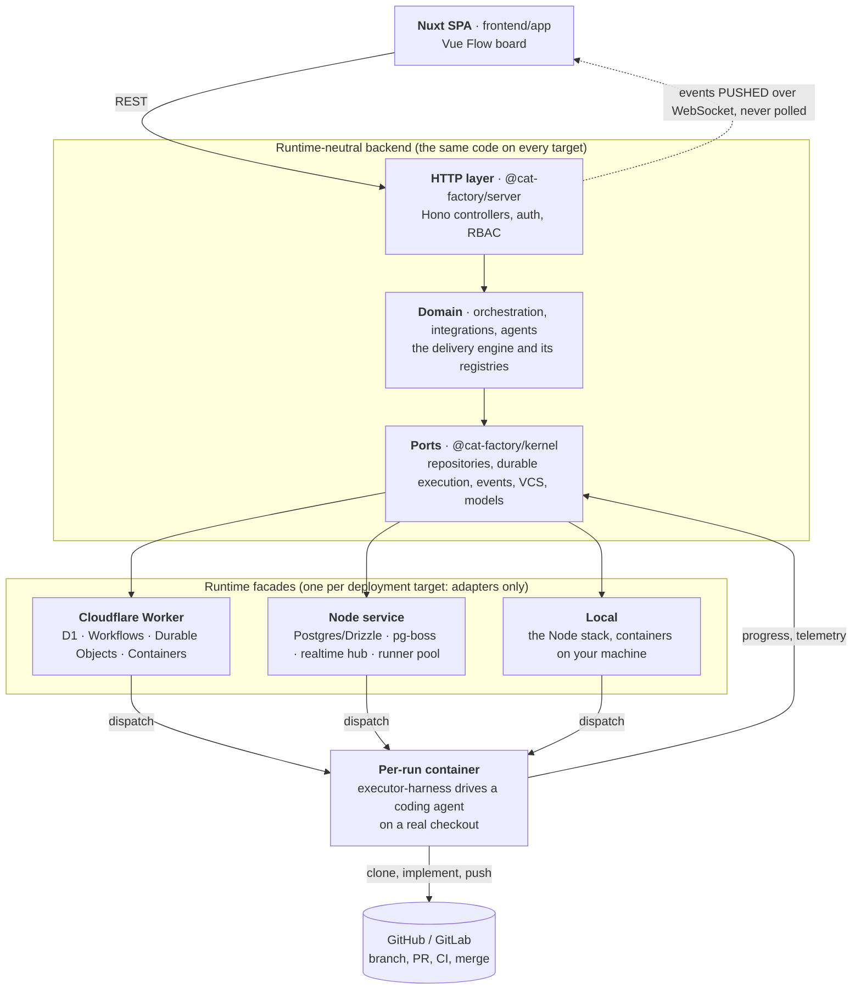

# cat-factory

**Plan software work on a visual board, and let LLM agents deliver it as reviewed, CI-green pull
requests while your team keeps the decisions.**

[Website & docs](https://www.catfactory.ai/) ·
[Introduction](https://www.catfactory.ai/guide/introduction.html) ·
[First task tutorial](https://www.catfactory.ai/guide/first-task-tutorial.html) ·
[Cookbook](https://www.catfactory.ai/guide/cookbook.html) · [MIT license](./LICENSE)

cat-factory is a self-hosted platform for running software delivery with agents. You lay out your
services and the tasks inside them on a board, or pull tasks in from Jira, Linear, GitHub or
GitLab. For each task, an **agent pipeline** does the work: it settles the requirements with you,
writes the code on a real checkout of your repository, reviews and tests it, and opens a pull
request that waits for green CI and your merge policy. You watch every step live and step in
wherever a person should decide.

It runs on your own infrastructure (your laptop, a Node.js server, Kubernetes or Cloudflare) with
the model providers you choose.

## Table of contents

- [How a task becomes a pull request](#how-a-task-becomes-a-pull-request)
- [Try it locally](#try-it-locally)
- [Where to go next](#where-to-go-next)
- [What you get](#what-you-get)
- [How it works](#how-it-works)
- [Deployment](#deployment)
- [Repository layout](#repository-layout)
- [Working on cat-factory itself](#working-on-cat-factory-itself)

## How a task becomes a pull request

1. **Describe the work.** Put a task on the board inside the service it belongs to, or let a
   connected tracker file it the moment an issue is created.
2. **Settle the requirements.** A reviewer agent points out gaps, risks and open questions; you
   answer them, and the answers are folded back into the task.
3. **Build it.** A coding agent clones the linked repository in an isolated container, implements
   the change, and runs the service's own lint, test and build checks before anything is pushed.
4. **Verify it.** Reviewers, testers and (if you want them) multi-model review panels and rubric
   judges check the work and send it back when it falls short.
5. **Merge it.** The pull request carries a briefing written by the agent that did the work, plus a
   verification report. It merges once CI is green and your merge policy allows it, either
   automatically or after a person approves.

Along the way you choose which model runs each step, which steps need a human sign-off, and how
much the organisation may spend per month. When a run needs you, the board says so.

## Try it locally

You need **Node 24 or newer** and a **container runtime** (Docker, Podman, OrbStack, Colima or
Apple `container`). One command scaffolds a local deployment in a new directory:

```sh
npx @cat-factory/cli init
```

It asks a few questions (project name, whether agents run in Docker or through your own installed
`claude`/`codex` CLI, GitHub or GitLab), generates the secrets the server needs, and helps you mint
a source-control token. Then start the two halves, each in its own terminal:

```sh
cd <project>/local    && npm install && npm run db:up && npm start   # backend on :8787
cd <project>/frontend && npm install && npm run dev                  # app on :3000
```

The first backend start takes a minute while it pulls the image agents run in. Open
<http://localhost:3000>, add a **model provider** (Cloudflare Workers AI is the quickest; any
vendor API key works), connect a repository, and start your first task. The
[first task tutorial](https://www.catfactory.ai/guide/first-task-tutorial.html) walks through that
run step by step.

More detail: [Run locally](https://www.catfactory.ai/deploy/local.html) on the website, and the
[`@cat-factory/cli` reference](./backend/packages/cli/README.md) for every flag and subcommand.

## Where to go next

The product documentation lives on **[catfactory.ai](https://www.catfactory.ai/)**. This repository
documents how cat-factory is built.

| I want to...                            | Read                                                                                                                                                                                            |
| --------------------------------------- | ----------------------------------------------------------------------------------------------------------------------------------------------------------------------------------------------- |
| Understand what it is and who it is for | [Introduction](https://www.catfactory.ai/guide/introduction.html) · [Core concepts](https://www.catfactory.ai/guide/core-concepts.html)                                                         |
| Run my first task end to end            | [First task tutorial](https://www.catfactory.ai/guide/first-task-tutorial.html) · [Quick start](https://www.catfactory.ai/guide/quick-start.html)                                               |
| Pick or change a pipeline               | [Choosing a pipeline](https://www.catfactory.ai/guide/choosing-a-pipeline.html) · [Cookbook](https://www.catfactory.ai/guide/cookbook.html)                                                     |
| Deploy it for my team                   | [Node.js](https://www.catfactory.ai/deploy/nodejs.html) · [Cloudflare](https://www.catfactory.ai/deploy/cloudflare.html) · [Configuration](https://www.catfactory.ai/deploy/configuration.html) |
| Add my own agents, gates or providers   | [Custom agents](https://www.catfactory.ai/extend/custom-agents.html) · [Custom providers](https://www.catfactory.ai/extend/custom-providers.html)                                               |
| Drive it from another system            | [Public API](https://www.catfactory.ai/extend/public-api.html) · [SDKs](https://www.catfactory.ai/extend/sdks.html) · [MCP server](https://www.catfactory.ai/extend/mcp-server.html)            |
| Operate it and diagnose a failed run    | [Observability](https://www.catfactory.ai/operate/observability.html) · [Troubleshooting](https://www.catfactory.ai/operate/troubleshooting.html)                                               |
| Understand the security model           | [Agent isolation](https://www.catfactory.ai/reference/agent-isolation.html) · [Security model](https://www.catfactory.ai/reference/security-model.html)                                         |
| Change the code in this repository      | [Working on cat-factory itself](#working-on-cat-factory-itself)                                                                                                                                 |

## What you get

A short tour. Every capability is described in full in
[`docs/capabilities.md`](./docs/capabilities.md).

- **A board that is the plan.** Services, modules and tasks on a zoomable canvas, with dependency
  edges and tasks sorted into status lanes. Point cat-factory at an existing repository and it maps
  the codebase onto the board for you.
- **Agent pipelines you can shape.** Reusable chains of steps (architect, coder, reviewer, tester
  and more), a ladder of ready-made presets, per-step model choice, editable agent prompts, and
  expensive steps that skip themselves on small tasks.
- **Real code, verified before you see it.** Agents work on a real checkout, run your checks before
  opening a pull request, and back each change with a verification report that pairs every
  requirement with its evidence.
- **Review that scales.** Deep review of large pull requests, multi-model consensus panels, and
  rubric judges that send weak work back to the agent that produced it.
- **Humans hold the levers.** Decision prompts, step gates with named approvers, merge rules per
  kind of change and per role, and an audit log of who did what.
- **Bug work, end to end.** Hunt a codebase for unreported defects, rank a tracker's open bugs by
  impact against effort, and prove a fix with a test that fails before it and passes after.
- **Test environments on demand.** Per-pull-request preview environments on Kubernetes, Cloudflare
  or your own tooling, for the agents that deploy and test.
- **Connected to your tools.** GitHub and GitLab, Jira, Linear, Confluence, Notion and Figma, plus
  Slack, email and webhook notifications.
- **Spend under control.** An organisation-wide monthly budget with forecasts and alerts; runs pause
  at the cap instead of overrunning it.
- **Observable to the last token.** Every step, model call and tool call is recorded, with
  failure-first triage, spend reports and OpenTelemetry or Langfuse export.
- **Built to be extended.** A deployment adds its own agent kinds, gates, judges, tool servers
  (MCP), model providers, runner pools and UI modules in its own code, without forking.
- **Headless when you need it.** A stable `/api/v1` with official TypeScript, Python, Go and Java
  clients, and an MCP server.

## How it works



A run is **durable**: the server advances it one checkpointed step at a time, so it keeps going
whether or not a browser is open and survives restarts. The long agent work happens in a container,
and every state change is pushed to the board as it happens.

Everything above the facade line is the same code on every deployment target. Each facade supplies
only the storage, job queue and container adapters for its platform, and a shared conformance suite
runs the same assertions against all of them.

Deeper reading: [Architecture](https://www.catfactory.ai/reference/architecture.html) on the
website, the [backend overview](./backend/README.md), and the
[flow index](./docs/flow-index.md) for each runtime flow in turn.

## Deployment

cat-factory ships as libraries on npm plus a runner image on GHCR and Docker Hub. A deployment is a
small project of its own that depends on those packages and carries its own configuration and
secrets. The `deploy/*` directories here are **templates** to copy: every id and hostname in them is
a placeholder, and this repository operates no deployment of its own.

| Target                          | Good for                                              | Guide                                                          | Template                                                                                          |
| ------------------------------- | ----------------------------------------------------- | -------------------------------------------------------------- | ------------------------------------------------------------------------------------------------- |
| **Local**                       | Trying it out; one developer on their own machine     | [Run locally](https://www.catfactory.ai/deploy/local.html)     | [`deploy/local`](./deploy/local/README.md)                                                        |
| **Node.js** (Postgres)          | A team server, as a process or a container            | [Node.js](https://www.catfactory.ai/deploy/nodejs.html)        | [`deploy/node`](./deploy/node/README.md)                                                          |
| **Cloudflare** (Worker + Pages) | A serverless deployment on Workers, D1 and Containers | [Cloudflare](https://www.catfactory.ai/deploy/cloudflare.html) | [`deploy/backend`](./deploy/backend/README.md) + [`deploy/frontend`](./deploy/frontend/README.md) |

Every target also needs a source-control connection
([GitHub App](https://www.catfactory.ai/deploy/github-app.html) or a GitLab token) and sign-in
([configuration](https://www.catfactory.ai/deploy/configuration.html),
[enterprise SSO](https://www.catfactory.ai/deploy/sso.html)). Every environment variable is listed
in [Environment variables](https://www.catfactory.ai/reference/environment-variables.html).

Already running a Kubernetes cluster? Agent jobs and per-pull-request preview environments can run
on it, whichever target hosts the backend: [Kubernetes](https://www.catfactory.ai/deploy/kubernetes.html).

## Repository layout

One pnpm workspace. The short map:

| Path               | What lives there                                                                                       |
| ------------------ | ------------------------------------------------------------------------------------------------------ |
| `frontend/app`     | The board UI: a reusable Nuxt layer a deployment extends.                                              |
| `backend/packages` | The published backend libraries: contracts, kernel, the orchestration engine, integrations, providers. |
| `backend/runtimes` | One facade per deployment target: Cloudflare Worker, Node.js service, local mode.                      |
| `backend/internal` | Unpublished tooling: the agent container harness, test suites, benchmarks, worked extension examples.  |
| `sdk`              | The public-API clients (TypeScript, Python, Go, Java), the MCP server and the gatekeeper bindings.     |
| `deploy`           | Deployment templates to copy.                                                                          |
| `docs`             | Repository-wide docs; backend design docs and ADRs are in `backend/docs`.                              |

Every package, its role and where it is published:
[`docs/repository-layout.md`](./docs/repository-layout.md).

## Working on cat-factory itself

Everything above is about using the platform. This part is for changing it.

- [`CONTRIBUTING.md`](./CONTRIBUTING.md): setting up the workspace, the common commands, and the
  changeset every PR needs.
- [`AGENTS.md`](./AGENTS.md): the rules every change is held to (runtime symmetry, size ratchets,
  compatibility, logging and more). It is also what orients a coding agent, and each package
  carries its own `AGENTS.md` with a "where things live" map.
- [`docs/README.md`](./docs/README.md): the map of this repository's docs, including the feature
  guide that pairs each capability with its website page and its design doc.
- [`docs/glossary.md`](./docs/glossary.md): the code-level naming map (block vs task vs card,
  directory vs package names). The product vocabulary is the website's
  [Glossary](https://www.catfactory.ai/reference/glossary.html).
- [Running the tests](./docs/internal/running-tests.md): the Postgres the Node and local suites
  need, and the traps that make a working tree look broken without one.
