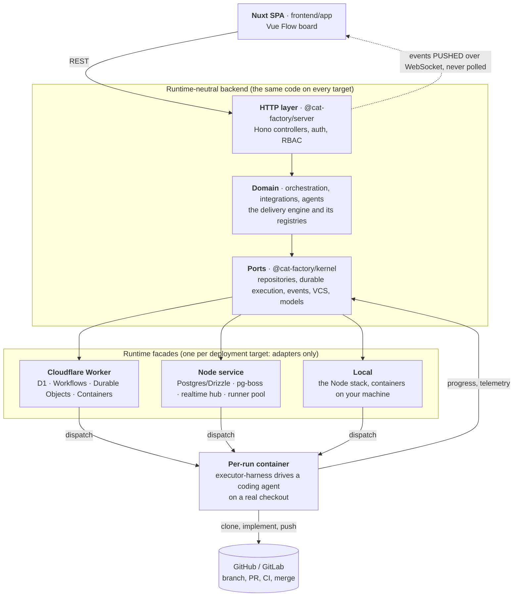

# cat-factory

Website: [www.catfactory.ai](http://www.catfactory.ai) ·
**[Cookbook](https://www.catfactory.ai/guide/cookbook.html)**: task-oriented recipes for
changing a pipeline you already run (add a review step, add a gate, change a step's
prompt, attach a skill), each a few minutes in the pipeline builder.

**A self-hosted platform that runs the software delivery loop with LLM agent
pipelines, turning board tasks and tracker issues into reviewed, CI-gated,
policy-merged pull requests, with humans holding the decisions and every step
and model call observable in real time.**

Work arrives as tasks on a visual board of **services → modules → tasks**, as
issues pushed from a connected tracker the moment they are filed, or headlessly
over the `/api/v1` surface and its official SDKs. An **agent pipeline** carries
each task through the whole loop: requirements are settled with you up front,
architects design, coding agents implement on a real checkout of the linked
GitHub or GitLab repository, and reviewers, testers, consensus panels and
rubric judges verify the work before the merge gates hold the PR for green CI
and your merge policy, then merge it for real. Humans keep the levers: decision
prompts, PR review, per-class merge rules, credential policy and a hard spend
cap. Every seam is a registry, so a deployment adds its own agent kinds, gates,
judges, tool servers and runner infrastructure without forking.

## Table of contents

- [Quickstart](#quickstart)
- [What it is](#what-it-is)
- [What it supports](#what-it-supports)
- [How it works](#how-it-works)
- [Repository layout](#repository-layout)
- [Feature guide](#feature-guide)
- [Documentation index](#documentation-index)
- [Deployment](#deployment)
- [Working on cat-factory itself](#working-on-cat-factory-itself)

## Quickstart

One command scaffolds a **local-mode deployment** on your own machine: a Node
backend and the frontend SPA, both depending on the published libraries, so the
generated project stands alone outside this repo.

```sh
npx @cat-factory/cli init
```

It walks you through the choices that matter: the project name, whether agents
run in a prewarmed Docker pool or on your own installed `claude`/`codex` CLI,
and which source-control provider to connect. Along the way it generates the
three crypto secrets the server requires in the exact formats it expects, opens
your browser at GitHub's or GitLab's token page with the right scopes already
selected, and reads the token back without echoing it. Both `.env` files are
written and gitignored for you. Add `--yes` and flags to skip the prompts.

You will need **Node 24 or newer**, since the scaffolded entry runs on Node's
own TypeScript type stripping, and a **container runtime**: Docker, Podman,
OrbStack, Colima and Apple `container` all work. It runs the Postgres from the
generated `docker-compose.yml`, plus the agent containers unless you chose to
run them natively.

Then run the two halves, each from the project root, in its own terminal:

```sh
cd <project>/local    && npm install && npm run db:up && npm start   # backend on :8787
cd <project>/frontend && npm install && npm run dev                  # SPA on :3000
```

Give the first backend start a minute: it pulls the executor-harness image your
agent jobs run in before it begins serving, and later starts reuse it.

The last piece is a **model provider**. Add one in `local/.env` before you
start, or sign in and add it through the UI. Cloudflare Workers AI is the
quickest to set up, and any direct vendor key works. The board comes up without
one, but no model is selectable until you add it, so no pipeline can start.

From there: connect the repo you want agents to work on, put a task on the
board, and start a run. Full CLI reference (every flag, the `env` / `k3s` /
`supervise` subcommands, what exactly gets scaffolded):
[`@cat-factory/cli`](./backend/packages/cli/README.md). The local mode itself
(container-runtime matrix, repo linking, the warm pool, ephemeral environments):
[`deploy/local/README.md`](./deploy/local/README.md).

**Other ways to run it**, all covered under [Deployment](#deployment): the
Cloudflare Worker (D1 + Workflows + Containers), a long-running **Node.js
service** over Postgres, or this repo's own `deploy/*` packages if you would
rather copy a worked example than generate one.

## What it is

cat-factory is a **software-development agent management platform**. It is
**self-hosted** and runs end-to-end on Cloudflare: a Nuxt single-page app talks
to a Cloudflare Worker (Hono + D1), and the heavy coding work runs in per-run
Cloudflare Containers (or your own runner pool). It pairs a spatial planning
surface (a Vue Flow canvas) with a durable, server-side execution engine so runs
make progress whether or not a browser is open.

Two ideas anchor the model:

- **The board is the plan.** A "service" is a `Block` with `level: 'frame'`;
  modules are sub-frames, tasks are leaves. Dependencies are edges. The board is
  both the design artifact and the unit of work agents act on.
- **Agents do real work through pull requests.** The implementation phases run a
  coding agent on an actual checkout; "done" means a PR exists and its CI is
  green, not merely that text was generated.

## What it supports

| Capability                               | What you get                                                                                                                                                                                                                                                                                                                                                                                                                                                                                                                                                                                                                                                                                                                                                                                                                                                                                                                                                                                                                                                                                                                                                                                                                                                                                                                                                                                                                                                                                                                                                                                                                                                                                                                                                                                                                                                                                                                                                                                                                                                                                                                                                                                                                                                                                                                                                                                                                                                                                                                                                                                                                                                                                                                                                                                                                                                                                                                                                                                                                                                                                                                                                                                                                                                                                                                                                                                                                                                                                                                                                                                                                                                                                                                                                                                     |
| ---------------------------------------- | ------------------------------------------------------------------------------------------------------------------------------------------------------------------------------------------------------------------------------------------------------------------------------------------------------------------------------------------------------------------------------------------------------------------------------------------------------------------------------------------------------------------------------------------------------------------------------------------------------------------------------------------------------------------------------------------------------------------------------------------------------------------------------------------------------------------------------------------------------------------------------------------------------------------------------------------------------------------------------------------------------------------------------------------------------------------------------------------------------------------------------------------------------------------------------------------------------------------------------------------------------------------------------------------------------------------------------------------------------------------------------------------------------------------------------------------------------------------------------------------------------------------------------------------------------------------------------------------------------------------------------------------------------------------------------------------------------------------------------------------------------------------------------------------------------------------------------------------------------------------------------------------------------------------------------------------------------------------------------------------------------------------------------------------------------------------------------------------------------------------------------------------------------------------------------------------------------------------------------------------------------------------------------------------------------------------------------------------------------------------------------------------------------------------------------------------------------------------------------------------------------------------------------------------------------------------------------------------------------------------------------------------------------------------------------------------------------------------------------------------------------------------------------------------------------------------------------------------------------------------------------------------------------------------------------------------------------------------------------------------------------------------------------------------------------------------------------------------------------------------------------------------------------------------------------------------------------------------------------------------------------------------------------------------------------------------------------------------------------------------------------------------------------------------------------------------------------------------------------------------------------------------------------------------------------------------------------------------------------------------------------------------------------------------------------------------------------------------------------------------------------------------------------------------------ |
| **Visual architecture boards**           | A pannable/zoomable canvas of frames (services), modules and tasks with dependency edges, drag-drop reparenting, and semantic level-of-detail.                                                                                                                                                                                                                                                                                                                                                                                                                                                                                                                                                                                                                                                                                                                                                                                                                                                                                                                                                                                                                                                                                                                                                                                                                                                                                                                                                                                                                                                                                                                                                                                                                                                                                                                                                                                                                                                                                                                                                                                                                                                                                                                                                                                                                                                                                                                                                                                                                                                                                                                                                                                                                                                                                                                                                                                                                                                                                                                                                                                                                                                                                                                                                                                                                                                                                                                                                                                                                                                                                                                                                                                                                                                   |
| **Basic / advanced modes**               | The SPA renders at one of two interface tiers. `basic` (the default) shows the everyday surface: the power-user navigation destinations are hidden and the run options that only exist to override a workspace default are left at that default; `advanced` shows everything. A deployment can pin the tier with `NUXT_PUBLIC_UI_MODE`, otherwise each user picks their own from the sidebar and the choice is remembered in their browser. The sidebar also collapses to an icon rail (basic mode starts collapsed). [Details](./frontend/app/README.md#interface-modes-basic--advanced)                                                                                                                                                                                                                                                                                                                                                                                                                                                                                                                                                                                                                                                                                                                                                                                                                                                                                                                                                                                                                                                                                                                                                                                                                                                                                                                                                                                                                                                                                                                                                                                                                                                                                                                                                                                                                                                                                                                                                                                                                                                                                                                                                                                                                                                                                                                                                                                                                                                                                                                                                                                                                                                                                                                                                                                                                                                                                                                                                                                                                                                                                                                                                                                                        |
| **Agent tiers**                          | Agent kinds are classified `basic` / `intermediate` / `advanced`, and the two surfaces that list the whole catalog (the pipeline builder's palette and a model preset's per-agent overrides) show only the **basic** tier by default, so a first pipeline is assembled from the everyday kinds instead of the full roster. A control on each widens the view one level at a time, up to the whole catalog, and the choice is remembered. Independent of the basic/advanced interface mode. A deployment's own registered agent kinds declare their tier alongside their icon and label. [Details](./frontend/app/README.md#agent-tiers-basic--intermediate--advanced)                                                                                                                                                                                                                                                                                                                                                                                                                                                                                                                                                                                                                                                                                                                                                                                                                                                                                                                                                                                                                                                                                                                                                                                                                                                                                                                                                                                                                                                                                                                                                                                                                                                                                                                                                                                                                                                                                                                                                                                                                                                                                                                                                                                                                                                                                                                                                                                                                                                                                                                                                                                                                                                                                                                                                                                                                                                                                                                                                                                                                                                                                                                            |
| **In-app tutorial tours**                | On first launch the app asks whether you want a guided tour and remembers the answer. Tours run inside the live app: they highlight the actual control for each step, tell you what to click, and follow along as you really do it (opening the real modal, creating a real task). Steps whose control your role or deployment doesn't show are skipped, and a **Tutorials** catalogue in the sidebar lists every walkthrough the deployment ships: with completion tracked per tour, so any of them can be started, resumed or repeated at any time, and the ones this board cannot demonstrate yet named alongside what would unlock them rather than quietly omitted. The built-ins cover the delivery loop end to end (find your way around, link a repository, create a task, run it, answer it when it pauses for you, review and merge it) and the platform behind it (connect a model provider, design your own pipeline, curate the standards agents follow, connect your tracker/documents/chat/monitors); the first-launch question stays the delivery arc, and the rest waits in the catalogue for when you go looking. Tours are declarative data over the same extension registry as the rest of the SPA, so a deployment ships its own beside the built-ins. [Details](./frontend/app/README.md#in-app-tutorial-tours)                                                                                                                                                                                                                                                                                                                                                                                                                                                                                                                                                                                                                                                                                                                                                                                                                                                                                                                                                                                                                                                                                                                                                                                                                                                                                                                                                                                                                                                                                                                                                                                                                                                                                                                                                                                                                                                                                                                                                                                                                                                                                                                                                                                                                                                                                                                                                                                                                                                            |
| **Enterprise SSO**                       | Sign in through your organisation's own identity provider: ONE generic OpenID Connect adapter configured by discovery URL and client credentials, so Okta, Microsoft Entra ID, Auth0, Keycloak, PingFederate, OneLogin, JumpCloud, Google Workspace and a Shibboleth IdP running the OIDC OP plugin all work with no per-vendor setup. Authorization Code + PKCE, ID tokens verified against the provider's JWKS (asymmetric algorithms only, with automatic key-rotation refetch). Who may sign in is the directory's app assignment, optionally narrowed to named groups or verified email domains, re-checked on every sign-in. Resolves to the same canonical user as every other login method, so nothing downstream changes.                                                                                                                                                                                                                                                                                                                                                                                                                                                                                                                                                                                                                                                                                                                                                                                                                                                                                                                                                                                                                                                                                                                                                                                                                                                                                                                                                                                                                                                                                                                                                                                                                                                                                                                                                                                                                                                                                                                                                                                                                                                                                                                                                                                                                                                                                                                                                                                                                                                                                                                                                                                                                                                                                                                                                                                                                                                                                                                                                                                                                                                               |
| **Audit log & session revocation**       | Every privileged account action leaves a record of **who did what, when**: membership and role changes, invitations sent, accepted and withdrawn, budget and settings edits, board roster and access-mode changes. Append-only, kept in its own store on a retention window of its own (default two years) so it cannot be shortened by tuning something else, and read from an admin panel as translated sentences composed from machine-readable fields — so a row written today still reads correctly for someone in another language years later, and an action this build no longer recognises is named as unrecognised rather than dropped. Beside it, **session revocation**: sessions are signed tokens, so ending one used to mean waiting for it to expire. Each user now carries a session generation that every token is stamped with, and advancing it invalidates the lot in a single write. A person can sign themselves out of every device; an admin can do it for a member who has left or lost a laptop; and an SSO sign-in the directory now refuses cuts the sessions that person is already holding, which is what makes "we disabled them in the identity provider and they lost access" true rather than eventually true. See [`backend/docs/auth.md`](./backend/docs/auth.md#session-revocation).                                                                                                                                                                                                                                                                                                                                                                                                                                                                                                                                                                                                                                                                                                                                                                                                                                                                                                                                                                                                                                                                                                                                                                                                                                                                                                                                                                                                                                                                                                                                                                                                                                                                                                                                                                                                                                                                                                                                                                                                                                                                                                                                                                                                                                                                                                                                                                                                                                                                       |
| **Accounts & workspaces**                | A signed-in user switches between a personal account and any **orgs** they belong to; an account owns many **workspaces** (boards). Visibility is by membership.                                                                                                                                                                                                                                                                                                                                                                                                                                                                                                                                                                                                                                                                                                                                                                                                                                                                                                                                                                                                                                                                                                                                                                                                                                                                                                                                                                                                                                                                                                                                                                                                                                                                                                                                                                                                                                                                                                                                                                                                                                                                                                                                                                                                                                                                                                                                                                                                                                                                                                                                                                                                                                                                                                                                                                                                                                                                                                                                                                                                                                                                                                                                                                                                                                                                                                                                                                                                                                                                                                                                                                                                                                 |
| **Agent pipelines**                      | Reusable, ordered chains of agent steps (architect → coder → blueprints → reviewer → tester → acceptance, plus mocker/playwright/deployer/custom kinds) applied per block. Builds start from a three-rung **ladder** varying the one thing that actually differs between tasks: how much design the work needs: **Standard build** (the default: design, challenge the design, implement, review, test, then gate and merge), **Simple build** for trivial work whose approach is not in question, and **Adaptive build**, which sizes the task up itself and switches the design, testing and human-PR-review steps on only when the work warrants them. Each carries a description (the pickers preview a pipeline's steps + description before you choose it) and a use-case **purpose** (`build`/`document`/`review`/`research`/`planning`) that scopes it to matching tasks: a document task offers only document pipelines (defaulting to the doc-writing one), a review task only the PR-review pipeline, and a feature/bug task is not offered the document, review or planning presets, and narrows the builder's agent palette. The board's copy of the built-in library is kept current explicitly rather than silently: newly shipped pipelines are offered for adding, an improved one is adopted on request (keeping your labels and archive state), and one that has been withdrawn from the catalog is flagged as retired with its replacement named, so an obsolete pipeline can actually be removed instead of lingering in every board forever.                                                                                                                                                                                                                                                                                                                                                                                                                                                                                                                                                                                                                                                                                                                                                                                                                                                                                                                                                                                                                                                                                                                                                                                                                                                                                                                                                                                                                                                                                                                                                                                                                                                                                                                                                                                                                                                                                                                                                                                                                                                                                                                                                                                                                               |
| **Estimate-gated steps**                 | A pipeline step can declare the task estimate it is worth paying for, and the engine transparently **skips** it below that bar, so one pipeline covers the range that used to need several near-identical presets. It applies to any step whose result later steps read as context (a design, a review, an extra verification pass, a human PR review), never to one whose absence would break the run: the merge guards, the environment provisioner and the merge itself are always unconditional. A skipped design step takes its review companion with it rather than leaving it grading the wrong artifact. The estimate may **add** a human checkpoint but never cancel an approval pause a pipeline author asked for, so a model's own triage can never decide that nobody needs to look.                                                                                                                                                                                                                                                                                                                                                                                                                                                                                                                                                                                                                                                                                                                                                                                                                                                                                                                                                                                                                                                                                                                                                                                                                                                                                                                                                                                                                                                                                                                                                                                                                                                                                                                                                                                                                                                                                                                                                                                                                                                                                                                                                                                                                                                                                                                                                                                                                                                                                                                                                                                                                                                                                                                                                                                                                                                                                                                                                                                                 |
| **Configurable step gates**              | A pipeline's human checkpoints carry a policy, not just an on/off flag: **who** may clear one (workspace roles, named people, or anyone entitled to write) and **how many of them** must, counted across distinct people so nobody clears a two-person gate by clicking twice. The bar and the approver set are pinned when the gate is raised, so editing the pipeline cannot move a bar under the people already counted toward it, and the same policy governs requesting changes and rejecting, not only approving — a checkpoint the wrong person can reject is not a checkpoint. The same per-step seam carries a **gate's own settings** (a CI gate's fixer attempts on this pipeline, a release watch window, a review grace period), which each gate DECLARES: a deployment registering its own gate gets an authoring form from that declaration alone, and what the builder can save is exactly what a run will accept. See [ADR 0038](./backend/docs/adr/0038-per-step-gate-config.md).                                                                                                                                                                                                                                                                                                                                                                                                                                                                                                                                                                                                                                                                                                                                                                                                                                                                                                                                                                                                                                                                                                                                                                                                                                                                                                                                                                                                                                                                                                                                                                                                                                                                                                                                                                                                                                                                                                                                                                                                                                                                                                                                                                                                                                                                                                                                                                                                                                                                                                                                                                                                                                                                                                                                                                                              |
| **Editable agent prompts**               | Rewrite what any agent is told to do, per workspace, from the pipeline builder where its step is chosen. Every save appends a **version** rather than replacing the last one, so the whole history is there to compare against and switch back through, and "back to the built-in" is itself a recorded version that keeps tracking the shipped prompt as it improves rather than pinning a stale copy of it. The platform's own rules (the read-only guardrail, the answer-in-your-reply rule, the service's best-practice standards) are still appended on top and cannot be edited away.                                                                                                                                                                                                                                                                                                                                                                                                                                                                                                                                                                                                                                                                                                                                                                                                                                                                                                                                                                                                                                                                                                                                                                                                                                                                                                                                                                                                                                                                                                                                                                                                                                                                                                                                                                                                                                                                                                                                                                                                                                                                                                                                                                                                                                                                                                                                                                                                                                                                                                                                                                                                                                                                                                                                                                                                                                                                                                                                                                                                                                                                                                                                                                                                      |
| **Durable, observable execution**        | Runs are driven by Cloudflare Workflows and stream live step/subtask progress, decision prompts, and failures to the board over WebSockets.                                                                                                                                                                                                                                                                                                                                                                                                                                                                                                                                                                                                                                                                                                                                                                                                                                                                                                                                                                                                                                                                                                                                                                                                                                                                                                                                                                                                                                                                                                                                                                                                                                                                                                                                                                                                                                                                                                                                                                                                                                                                                                                                                                                                                                                                                                                                                                                                                                                                                                                                                                                                                                                                                                                                                                                                                                                                                                                                                                                                                                                                                                                                                                                                                                                                                                                                                                                                                                                                                                                                                                                                                                                      |
| **Real code changes via PRs**            | Coding agents (`coder`, `mocker`, `playwright`) run in a per-run container, clone the repo, implement, and open a PR; merge flips the block to done.                                                                                                                                                                                                                                                                                                                                                                                                                                                                                                                                                                                                                                                                                                                                                                                                                                                                                                                                                                                                                                                                                                                                                                                                                                                                                                                                                                                                                                                                                                                                                                                                                                                                                                                                                                                                                                                                                                                                                                                                                                                                                                                                                                                                                                                                                                                                                                                                                                                                                                                                                                                                                                                                                                                                                                                                                                                                                                                                                                                                                                                                                                                                                                                                                                                                                                                                                                                                                                                                                                                                                                                                                                             |
| **Pre-PR validation**                    | A service declares check commands (install/lint/test/build): by hand, or autodetected from the repo's own manifests, scripts and tool configs. After the coder finishes, the container runs them against the checkout **before** any PR is opened; a failure goes back to the agent with the captured output and it retries under an attempt budget. Only a green checkout opens a PR: a spent budget fails the step with the output attached and opens nothing. See [`docs/initiatives/pre-pr-validation.md`](./docs/initiatives/pre-pr-validation.md).                                                                                                                                                                                                                                                                                                                                                                                                                                                                                                                                                                                                                                                                                                                                                                                                                                                                                                                                                                                                                                                                                                                                                                                                                                                                                                                                                                                                                                                                                                                                                                                                                                                                                                                                                                                                                                                                                                                                                                                                                                                                                                                                                                                                                                                                                                                                                                                                                                                                                                                                                                                                                                                                                                                                                                                                                                                                                                                                                                                                                                                                                                                                                                                                                                         |
| **Dependency prepopulation**             | A service declares an install command (by hand, or autodetected alongside its validation checks) and the container runs it against the checkout **before the agent's first turn**, so agents read real installed packages instead of inferring what a library can do from a manifest entry. Applies to every agent that gets a checkout, reviewers and architects included, not only the ones that open a PR. Never a gate: a failed install is reported to the agent (which may install what it needs itself) and the run continues. See [`docs/initiatives/agent-dependency-prepopulation.md`](./docs/initiatives/agent-dependency-prepopulation.md).                                                                                                                                                                                                                                                                                                                                                                                                                                                                                                                                                                                                                                                                                                                                                                                                                                                                                                                                                                                                                                                                                                                                                                                                                                                                                                                                                                                                                                                                                                                                                                                                                                                                                                                                                                                                                                                                                                                                                                                                                                                                                                                                                                                                                                                                                                                                                                                                                                                                                                                                                                                                                                                                                                                                                                                                                                                                                                                                                                                                                                                                                                                                          |
| **Pre-dispatch input gate**              | A task states nothing an agent could act on, an empty or placeholder-only description, a bug with no reproduction context, a review task naming no pull request, and the run parks **before its first agent step**, having spent nothing. The check is a deterministic read of the task's own fields, so it costs no model call where the requirements reviewer previously spent one to report the same absence. Fix the task and re-check (the fix is verified, not asserted) or run anyway; a workspace can turn it down to advisory or off. See [`docs/initiatives/pre-dispatch-input-gate.md`](./docs/initiatives/pre-dispatch-input-gate.md).                                                                                                                                                                                                                                                                                                                                                                                                                                                                                                                                                                                                                                                                                                                                                                                                                                                                                                                                                                                                                                                                                                                                                                                                                                                                                                                                                                                                                                                                                                                                                                                                                                                                                                                                                                                                                                                                                                                                                                                                                                                                                                                                                                                                                                                                                                                                                                                                                                                                                                                                                                                                                                                                                                                                                                                                                                                                                                                                                                                                                                                                                                                                               |
| **Requirements review**                  | A stateless reviewer agent raises gaps/clarifications/assumptions/risks on a block; a human answers each, then the agent folds the answers back into the description.                                                                                                                                                                                                                                                                                                                                                                                                                                                                                                                                                                                                                                                                                                                                                                                                                                                                                                                                                                                                                                                                                                                                                                                                                                                                                                                                                                                                                                                                                                                                                                                                                                                                                                                                                                                                                                                                                                                                                                                                                                                                                                                                                                                                                                                                                                                                                                                                                                                                                                                                                                                                                                                                                                                                                                                                                                                                                                                                                                                                                                                                                                                                                                                                                                                                                                                                                                                                                                                                                                                                                                                                                            |
| **Deep PR review**                       | A `review` task runs a token-bounded reviewer over an open PR (slicing a huge diff into cohesive chunks) and surfaces prioritized findings. A human triages them in the dedicated window: **select** which matter, **dismiss** the noise, or **challenge** any one (with an optional concern) to dispatch a Challenge Investigator that re-examines it against the full source and either strengthens or retracts it: then resolves the review by finishing, feeding a fixer, or posting the findings as inline PR comments. Each slice's review is persisted the moment its subagent reports rather than at the finish line, so a review that dies, or wedges in its final aggregation pass, which looks identical to a wedge from outside, can be **resumed** for only the slices that never came back, folding the finished ones' findings into the new aggregate instead of re-reviewing 20 minutes of work. The target PR is checked against the service's repository as the task is created: a number that does not exist there, or a link belonging to another repository, is refused with a reason rather than becoming a run with nothing to review, and the task's inspector links the pull request it reviews. See [`backend/docs/adr/0023-pr-deep-review.md`](./backend/docs/adr/0023-pr-deep-review.md).                                                                                                                                                                                                                                                                                                                                                                                                                                                                                                                                                                                                                                                                                                                                                                                                                                                                                                                                                                                                                                                                                                                                                                                                                                                                                                                                                                                                                                                                                                                                                                                                                                                                                                                                                                                                                                                                                                                                                                                                                                                                                                                                                                                                                                                                                                                                                                                                                                                                            |
| **Merge track record**                   | Every merge decision leaves behind what KIND of change it was: a deterministic class derived from the changed files (`docs` / `test` / `dependency` / `config` / `source` / `schema`): the merger's scores, and a one-tap **reviewer-effort tag** a human leaves when confirming the merge. Per-class rollups are SQL aggregates, and a merge preset can carry per-class rules ("always auto-merge dependency bumps", "always review schema changes") that a workspace widens as the per-class record earns it. See [`./backend/docs/adr/0046-merge-track-record.md`](./backend/docs/adr/0046-merge-track-record.md).                                                                                                                                                                                                                                                                                                                                                                                                                                                                                                                                                                                                                                                                                                                                                                                                                                                                                                                                                                                                                                                                                                                                                                                                                                                                                                                                                                                                                                                                                                                                                                                                                                                                                                                                                                                                                                                                                                                                                                                                                                                                                                                                                                                                                                                                                                                                                                                                                                                                                                                                                                                                                                                                                                                                                                                                                                                                                                                                                                                                                                                                                                                                                                            |
| **Runs scoped to who started them**      | A merge preset can also say what a run may do based on WHO started it, so a product manager and an engineer running the same task are not held to the same policy. A workspace role can be narrowed per change class (auto-merge dependency bumps, but send a member's source changes to a human) and can be held to **dry runs**: the pipeline works and opens its pull request, and nothing merges, not automatically and not by tapping the review card either, so the person who started the run cannot be their own reviewer. A role can also be allowlisted to the kinds of change it may land at all, so a product manager keeps a real lane (copy, dependency bumps) on a service whose source they may not merge, refused at both exits like a dry run. Role entries are subtractive by construction: one can only ever take capability away from the preset it sits in, never add it, so it can be read on its own. Both are authored in workspace settings beside the rules they narrow, and anyone can ask for a sandboxed run of their own from the run control. A role the preset sandboxes cannot ask its way out, and the run says what it is from the start rather than looking like one that simply has not merged yet. See [ADR 0037](./backend/docs/adr/0037-role-scoped-merge-policy.md) and [ADR 0039](./backend/docs/adr/0039-role-scoped-submission-allowlists.md).                                                                                                                                                                                                                                                                                                                                                                                                                                                                                                                                                                                                                                                                                                                                                                                                                                                                                                                                                                                                                                                                                                                                                                                                                                                                                                                                                                                                                                                                                                                                                                                                                                                                                                                                                                                                                                                                                                                                                                                                                                                                                                                                                                                                                                                                                                                                                                                                      |
| **Agent-written PR briefings**           | A pipeline-opened pull request is described by the agent that did the work, not by text composed before it started. A PR-opening coding agent ends its run by writing a reviewer briefing (the problem, the decisions it made and the alternatives it rejected, what to look out for) to a sentinel file the harness lifts onto the PR it opens (an optional leading heading sets the title, and a resumed run refreshes the PR it already opened). The briefing is secret-scrubbed, size-capped so the engine's verification report still fits in the same body, and made inert for the host, so an agent writing "closes #42" cannot close issue 42 on merge. When the target repository ships a pull-request template, the briefing IS that template, filled in: the harness finds it in the checkout (both GitHub's and GitLab's conventions) and the agent that did the work answers its sections, because neither host applies a template to a pull request opened through its API. When no briefing is written the PR falls back to what the pipeline knew at dispatch (the task and the human-chosen implementation approach) and says so explicitly.                                                                                                                                                                                                                                                                                                                                                                                                                                                                                                                                                                                                                                                                                                                                                                                                                                                                                                                                                                                                                                                                                                                                                                                                                                                                                                                                                                                                                                                                                                                                                                                                                                                                                                                                                                                                                                                                                                                                                                                                                                                                                                                                                                                                                                                                                                                                                                                                                                                                                                                                                                                                                                    |
| **PR verification report**               | The ENGINE (not the agent) maintains a structured verification report on each run's PR: the `ci` gate's aggregated check runs + fixer attempts, the tester's structured report, a **requirement → evidence** table pairing every requirement in the service's in-repo `spec/` with what the tester actually observed (`met` / `not met` / `not checked`, so a verified behaviour never looks like one nobody checked, and a failure against a requirement the service was OBSERVED to honour is counted and flagged as a **regression** rather than reading like unfinished work), the platform's OWN run of the service's pre-PR check commands against the exact tree that was pushed (each command's exit code, and the captured log of whatever failed — the one verdict here the platform ENFORCED, as opposed to the host's later opinion in CI), a **bugfix reproduction proof** (the declared reproducing check run against the pre-fix tree AND the finished one, with both captured logs, so failing-then-passing is shown rather than claimed — or, when the bug genuinely cannot be reproduced in a test, the agent's structural declaration with its reason and what it verified instead, which is never the same thing as nobody having tried), a **test environment lifecycle proof** (the ephemeral environment came up at a recorded time, the tester's observations and captured screenshots are either attributed to it or explicitly are not, each screenshot linked DIRECTLY to its bytes on the deployment's own authenticated endpoint rather than listed as an opaque id, and it was torn down again AND an independent probe afterwards found it actually gone, which is a different fact from the provider having accepted the destroy call and is reported separately when only the first one holds; the verdict over those three legs is COMPUTED by the platform with every missing leg named, never an agent's claim that it tested against a preview), the merger's scored assessment, **what the run built FROM** (each linked page its agents read with the revision the dispatch confirmed it at, flagging any that CHANGED while the run was in flight, so an implementation that misread a design and one that faithfully implemented a revision the designer has since moved past stop reading the same), run metadata (linked tracker issues, pipeline, per-step agent kind + model), a deep link into the run's observability panel for a person, and, for a machine, direct links to the run's **auditable tool-call trajectory** (what its agents actually did, in order) and to this same report served live as JSON over `/api/v1`, so a reviewer checking a claim in the report does not have to know the debug API exists to find the record behind it. Human-readable markdown plus a fenced, schema-validated JSON block, updated **idempotently in place** on re-runs. A cross-service run opens one pull request per repo it changed and **every one of them gets a report**, each composed for the PR it lands on: run-wide evidence (the CI verdict that blocks the whole set, the tester, the merge) appears on all of them, while the sections that are statements about the task's own service (its pre-PR checks, its reproduction proof, its `spec/`) are withheld from a connected service's copy and point at the own-service PR instead, rather than crediting one repo's evidence to another repo's diff. Credentials are scrubbed and the host's auto-link/issue-closing triggers are neutralised before anything is written; per-workspace opt-out via `publishPrVerificationReport`. Provider-neutral: a GitLab MR gets it too. See [`docs/initiatives/pr-verification-report.md`](./docs/initiatives/pr-verification-report.md). |
| **Run outcome summary**                  | "Read the result" lands on an OUTCOME card, not a diff: what was asked (the requester's own words), which of the service's requirements the tester ruled on and what it observed against each, the tester's verdict and concerns, the screenshots it captured (paired with their reference designs when a human reviewed them), the linked pages the agents actually built from with the revision each was read at, and the checks that recorded a verdict. Composed from what the run already captured, never from a model asked to summarise itself, and every section that has nothing to show says WHICH producer was missing rather than rendering blank: "this pipeline has no tester step" and "the tester found nothing wrong" are opposite facts. In basic mode the card is what the board and the inspector open, with the pull request one click inside it; advanced mode keeps the direct PR link beside it. The in-app sibling of the PR verification report above, for the reader who is not going to open a diff, and it is not app-only: `GET /api/v1/runs/:runId/outcome` serves the same summary to anything holding a workspace key, so a bot posting "what shipped" to a channel says what the card says. Both documents are composed by the same code over one read of the run's evidence, so the coverage counts and the regression rule are the same numbers on the card, on the API and on the pull request.                                                                                                                                                                                                                                                                                                                                                                                                                                                                                                                                                                                                                                                                                                                                                                                                                                                                                                                                                                                                                                                                                                                                                                                                                                                                                                                                                                                                                                                                                                                                                                                                                                                                                                                                                                                                                                                                                                                                                                                                                                                                                                                                                                                                                                                                                                                                                             |
| **Custom agent capabilities**            | A deployment's own agent kinds declare what they KNOW and what they can REACH: **skills** (procedural playbooks; bundled in the deployment's own package, or synced from a repo) and **tool servers** (MCP; an issue tracker, an advisory database, an internal service), registered once and referenced by id from any number of kinds, or attached to a BUILT-IN kind without redefining it. Credentials are declared by name and resolved at dispatch, so a value never reaches a prompt or the run's telemetry. A tool the run cannot serve is stated to the agent rather than silently missing, and the step that ran records which servers it wired and which it dropped (with the reason), so a run that quietly went without one says so on the run surface; a registered server can also be TESTED from the Infrastructure window: the probe resolves that board's credentials through the same chain a run does, speaks MCP to the server, and reports a cause rather than a boolean, including whether the tools the declaration narrowed to actually exist, which nothing else in the platform can check. A REMOTE server that authenticates with **OAuth** (which most of the hosted MCP ecosystem does) is connected per board from that same window: someone with `secrets.manage` presses Connect, signs in at the vendor, and the sealed grant is refreshed for them from then on; a machine grant covers an internal server with nobody to press a button. See [`backend/docs/custom-agents.md`](./backend/docs/custom-agents.md) and, for the tool-server (MCP) model end to end, [`backend/docs/mcp-tool-servers.md`](./backend/docs/mcp-tool-servers.md).                                                                                                                                                                                                                                                                                                                                                                                                                                                                                                                                                                                                                                                                                                                                                                                                                                                                                                                                                                                                                                                                                                                                                                                                                                                                                                                                                                                                                                                                                                                                                                                                                                                                                                                                                                                                                                                                                                                                                                                                                                                                                                                   |
| **Reusable operations**                  | The work an organisation does over and over ("introduce an API on top of existing functionality", once per entity) is registered ONCE as a named operation in the deployment's own code, then invoked from the create-task form: someone picks it, fills a small per-case form (which entity, which operations to expose, which auth model), and one canned pipeline delivers the outcome. The collected answers are folded into every agent's prompt as the run's brief, and the standing context the org holds every such change to (its API guidelines, its auth requirements, its shared-services map) is attached automatically instead of being picked per task, so consistency does not depend on whoever filed the ticket remembering it. The operation carries its own pipeline as a read-only template the org rolls out and later updates by version, and a board that predates the operation adopts the pipeline the first time someone runs it rather than refusing. An org with twenty operations groups them under its own captions in the picker, and a workspace admin hides the ones that team does not run so its picker stays short. Operations are invocable headlessly too: `/api/v1` serves each type's form and takes the filled answers, so an external system can run one with the same brief a person would have typed. See [`backend/docs/reusable-operations.md`](./backend/docs/reusable-operations.md).                                                                                                                                                                                                                                                                                                                                                                                                                                                                                                                                                                                                                                                                                                                                                                                                                                                                                                                                                                                                                                                                                                                                                                                                                                                                                                                                                                                                                                                                                                                                                                                                                                                                                                                                                                                                                                                                                                                                                                                                                                                                                                                                                                                                                                                                                                                                                           |
| **External tools + workspace metadata**  | A deployment registers its own web applications (a map editor, an asset pipeline, an admin console) into an **External tools** sidebar section, each resolving its URL from the invocation context: the acting user, the open workspace, and the deployment's own **custom workspace metadata fields**, whose values operators fill in under Workspace settings. So a tool opens already switched to the right project instead of at its front door, and the platform needs no opinion about what `gameId` means. See [`consumer-extensions.md`](./frontend/app/app/docs/consumer-extensions.md).                                                                                                                                                                                                                                                                                                                                                                                                                                                                                                                                                                                                                                                                                                                                                                                                                                                                                                                                                                                                                                                                                                                                                                                                                                                                                                                                                                                                                                                                                                                                                                                                                                                                                                                                                                                                                                                                                                                                                                                                                                                                                                                                                                                                                                                                                                                                                                                                                                                                                                                                                                                                                                                                                                                                                                                                                                                                                                                                                                                                                                                                                                                                                                                                |
| **Rubric judges**                        | A deployment registers its own **judge** step: an evaluator that scores a run's work against a rubric (scope adherence, house engineering standards, doc completeness) and, below the task's threshold, **sends the work back** to the producing agent with the findings as its rework brief, asks a human, or stops the run. Adding one is a registry entry, not a fork: the engine owns the whole loop, the rubric's per-workspace override is an ordinary prompt-library fragment, and the verdict lands on the PR verification report. See [`docs/initiatives/judge-registry.md`](./docs/initiatives/judge-registry.md).                                                                                                                                                                                                                                                                                                                                                                                                                                                                                                                                                                                                                                                                                                                                                                                                                                                                                                                                                                                                                                                                                                                                                                                                                                                                                                                                                                                                                                                                                                                                                                                                                                                                                                                                                                                                                                                                                                                                                                                                                                                                                                                                                                                                                                                                                                                                                                                                                                                                                                                                                                                                                                                                                                                                                                                                                                                                                                                                                                                                                                                                                                                                                                     |
| **Consensus review panels**              | A review is a judgement, and a panel of independent models judges better than one. Any review step (the code reviewer, the deep PR reviewer, the document/design/spec companions) can be run as a multi-model **consensus** panel (independent drafts then neutral synthesis, a debate, or ranked voting) instead of a single agent. Because a panel costs several model calls, a workspace keeps a library of reusable **consensus groups**, each carrying the task-estimate bar it is worth paying for; a step names a SET of groups and the engine runs the most demanding one the task's estimate clears, falling back to the standard single agent when none does. So "a two-model review above 0.4 risk, the full five-model panel above 0.8" is one step rather than three conditional pipelines. The transcript records which panel fired. Requires the opt-in `@cat-factory/consensus` package (`CONSENSUS_ENABLED`).                                                                                                                                                                                                                                                                                                                                                                                                                                                                                                                                                                                                                                                                                                                                                                                                                                                                                                                                                                                                                                                                                                                                                                                                                                                                                                                                                                                                                                                                                                                                                                                                                                                                                                                                                                                                                                                                                                                                                                                                                                                                                                                                                                                                                                                                                                                                                                                                                                                                                                                                                                                                                                                                                                                                                                                                                                                                   |
| **In-repo service spec**                 | A `spec-writer` agent maintains the service's PRESCRIPTIVE specification **in the repo** (`spec/`: sharded requirements with Given/When/Then acceptance criteria, rendered to Gherkin `.feature` files), reviewed as an ordinary PR diff. Each requirement carries an **implementation state**: `aspirational` (agreed, not yet built) or `established` (a tester actually observed it hold). Only `established` requirements read as standing behaviour in a build prompt, so an agreed-but-unbuilt requirement is never implemented by accident nor reported as a regression, and a tester's first observed pass PROMOTES it automatically, with no human bookkeeping. The board's Requirements window shows that state per requirement, with a per-group rollup and a state filter, and a tester step renders its per-requirement verdicts in-app. Because the state is recorded, the PR verification report can tell a **regression** (an `established` requirement now failing) from work simply not finished yet. See [`docs/initiatives/service-acceptance-criteria.md`](./docs/initiatives/service-acceptance-criteria.md).                                                                                                                                                                                                                                                                                                                                                                                                                                                                                                                                                                                                                                                                                                                                                                                                                                                                                                                                                                                                                                                                                                                                                                                                                                                                                                                                                                                                                                                                                                                                                                                                                                                                                                                                                                                                                                                                                                                                                                                                                                                                                                                                                                                                                                                                                                                                                                                                                                                                                                                                                                                                                                                              |
| **Service blueprints**                   | A Blueprinter agent decomposes a repo into a `service → modules → features` map stored **in the repo** (`blueprints/`) and reconciles it onto the board.                                                                                                                                                                                                                                                                                                                                                                                                                                                                                                                                                                                                                                                                                                                                                                                                                                                                                                                                                                                                                                                                                                                                                                                                                                                                                                                                                                                                                                                                                                                                                                                                                                                                                                                                                                                                                                                                                                                                                                                                                                                                                                                                                                                                                                                                                                                                                                                                                                                                                                                                                                                                                                                                                                                                                                                                                                                                                                                                                                                                                                                                                                                                                                                                                                                                                                                                                                                                                                                                                                                                                                                                                                         |
| **Repo bootstrap**                       | Adapt a reference architecture (or scaffold from scratch) into a pre-created empty repo and force-push the result, materialising a new service frame on the board.                                                                                                                                                                                                                                                                                                                                                                                                                                                                                                                                                                                                                                                                                                                                                                                                                                                                                                                                                                                                                                                                                                                                                                                                                                                                                                                                                                                                                                                                                                                                                                                                                                                                                                                                                                                                                                                                                                                                                                                                                                                                                                                                                                                                                                                                                                                                                                                                                                                                                                                                                                                                                                                                                                                                                                                                                                                                                                                                                                                                                                                                                                                                                                                                                                                                                                                                                                                                                                                                                                                                                                                                                               |
| **On-demand board scan**                 | Decompose an existing repo into a board structure / reusable blueprint anchored to file references.                                                                                                                                                                                                                                                                                                                                                                                                                                                                                                                                                                                                                                                                                                                                                                                                                                                                                                                                                                                                                                                                                                                                                                                                                                                                                                                                                                                                                                                                                                                                                                                                                                                                                                                                                                                                                                                                                                                                                                                                                                                                                                                                                                                                                                                                                                                                                                                                                                                                                                                                                                                                                                                                                                                                                                                                                                                                                                                                                                                                                                                                                                                                                                                                                                                                                                                                                                                                                                                                                                                                                                                                                                                                                              |
| **Source-control integration**           | Connect a workspace to **GitHub** (a GitHub App) or **GitLab** (a per-workspace personal access token) for repo / pull-merge-request / issue read & write plus webhooks, with local projections kept fresh. The SPA offers whichever connect surfaces the deployment actually serves. See [`backend/docs/vcs-providers.md`](./backend/docs/vcs-providers.md).                                                                                                                                                                                                                                                                                                                                                                                                                                                                                                                                                                                                                                                                                                                                                                                                                                                                                                                                                                                                                                                                                                                                                                                                                                                                                                                                                                                                                                                                                                                                                                                                                                                                                                                                                                                                                                                                                                                                                                                                                                                                                                                                                                                                                                                                                                                                                                                                                                                                                                                                                                                                                                                                                                                                                                                                                                                                                                                                                                                                                                                                                                                                                                                                                                                                                                                                                                                                                                    |
| **Document & task sources**              | Link Confluence/Notion docs and Jira/Linear/GitHub/GitLab issues to a board: import, expand into structure, or attach as agent context. (GitLab issues import, search, check their setup and back both the recurring `bug-intake` schedule and the bug hunt, scoped to a project path; issue push intake and writeback are Jira/Linear/GitHub for now.) Requirements, RFCs, PRDs and tracker issues can be attached when creating a **task** or an **initiative**: an initiative's attachments feed its whole planning pipeline, so the interviewer stops asking what an attached document already answers and the analyst and planner ground the plan in it. A **design** is a first-class starting point rather than another document: a service frame carries a **Start from a design** button that takes a pasted Figma/Zeplin link, canonicalises it before anything is written (and says so separately when the frame you named could not be read and the whole file was attached instead), and hands it to the new task; a link pasted into any task description offers the same. Figma can be connected with **OAuth** where the deployment has registered an app, so a designer is not sent off to mint a personal access token, and expanding a design into board structure plans work INSIDE an existing service rather than proposing one service per Figma page. A linked design is also what the **visual-confirmation** gate compares against: the frames its last import retained populate the actual-vs-reference gallery on their own, labelled as the design's own rather than as somebody's attachment (an image a person uploaded for the same view still wins), and a design that retained fewer frames than it has says which of five reasons applies instead of just showing a shorter gallery.                                                                                                                                                                                                                                                                                                                                                                                                                                                                                                                                                                                                                                                                                                                                                                                                                                                                                                                                                                                                                                                                                                                                                                                                                                                                                                                                                                                                                                                                                                                                                                                                                                                                                                                                                                                                                                                                                                                                                                          |
| **Tracker webhooks**                     | Point a Jira/Linear/GitHub-Issues webhook at the workspace (per-connection HMAC secret) so intake starts **within seconds** of an issue being filed or labelled, instead of at the next recurring-schedule tick: the polling schedule stays on as the sweep for missed deliveries. The same channel carries **answers back in**: a reporter replies to a parked requirements review in the ticket (`@cat-factory answer <finding-id> …`) and the run resumes exactly as if answered in-app. A schedule can instead dispatch **per ticket**, so a triaged feature request runs as its own task straight from the tracker it was filed in. Trackers beyond the three built-ins are registered in code by a deployment. See [`backend/docs/adr/0032-tracker-webhook-intake.md`](./backend/docs/adr/0032-tracker-webhook-intake.md).                                                                                                                                                                                                                                                                                                                                                                                                                                                                                                                                                                                                                                                                                                                                                                                                                                                                                                                                                                                                                                                                                                                                                                                                                                                                                                                                                                                                                                                                                                                                                                                                                                                                                                                                                                                                                                                                                                                                                                                                                                                                                                                                                                                                                                                                                                                                                                                                                                                                                                                                                                                                                                                                                                                                                                                                                                                                                                                                                                 |
| **Bug hunt**                             | Pick a connected tracker and one of its boards, and cat-factory reads its **open, unassigned** bugs and rates each one on impact against how hard it looks to fix, so a team can answer "we have an afternoon, what is actually worth fixing?". You confirm a candidate and it is adopted onto the board as a bug task with the issue linked for context, running the standard bug-fix pipeline (investigate, triage with you, reproduce, fix, review, ship). Tracker facts and the model's judgement stay separate: the score is computed from the impact/effort ratings rather than taken from the reply, a rating naming an issue the board never returned is dropped, and a board whose rating was unavailable or failed still returns its scan, labelled as unrated rather than passed off as a ranking. The interactive counterpart of the recurring bug-triage schedule. See [`backend/docs/bug-hunt.md`](./backend/docs/bug-hunt.md).                                                                                                                                                                                                                                                                                                                                                                                                                                                                                                                                                                                                                                                                                                                                                                                                                                                                                                                                                                                                                                                                                                                                                                                                                                                                                                                                                                                                                                                                                                                                                                                                                                                                                                                                                                                                                                                                                                                                                                                                                                                                                                                                                                                                                                                                                                                                                                                                                                                                                                                                                                                                                                                                                                                                                                                                                                                    |
| **Ephemeral environments**               | Register your own preview-environment tooling via a declarative HTTP manifest so `deployer`/`tester` agents provision and run against it, or pick a built-in backend: per-PR Kubernetes/EKS namespaces, or a per-PR **Cloudflare Worker** driven over your repository's own preview workflow (no daemon, no cluster, works from every facade). A board picks its **default provisioning mechanism once** and every service added afterwards starts with it (still overridable per service); a board that hasn't chosen is prompted with a shareable link to the setting. A **`disposer`** step reclaims what a run stood up at the point in the pipeline its author places it (after the automated tester, or after a human has finished with the live URL) rather than leaving it to the TTL sweep; the recurring bug-triage preset ships with one at the end, because a scheduled run has nobody waiting to look at the environment it leaves behind. Every teardown — the step's, the sweep's, a manual Destroy — is followed by an INDEPENDENT probe, so an environment is reported reclaimed only when something actually looked and found it gone. See [`backend/docs/per-service-provisioning.md`](./backend/docs/per-service-provisioning.md) and [`docs/initiatives/environment-disposal-and-teardown-proof.md`](./docs/initiatives/environment-disposal-and-teardown-proof.md).                                                                                                                                                                                                                                                                                                                                                                                                                                                                                                                                                                                                                                                                                                                                                                                                                                                                                                                                                                                                                                                                                                                                                                                                                                                                                                                                                                                                                                                                                                                                                                                                                                                                                                                                                                                                                                                                                                                                                                                                                                                                                                                                                                                                                                                                                                                                                                                                        |
| **Infra declared in code**               | A service's full infra dependency set can be declared programmatically instead of filled into a form: hand `startNode`/`startLocal` a list of **shared stacks** (the long-lived compose infra its preview environments attach to) and every board comes up able to use them, seeded on boot and on board creation. A stack's ordered compose layers are no longer limited to files in one repo: each may be a path in the stack's own repo, a **compose document supplied inline**, or a **file in another repository** read without cloning it, so a stack can describe shared infrastructure that lives nowhere near the service using it, or own no repository at all. The same layer vocabulary works on a service's own stack recipe. Seeding is idempotent by name, so a stack an operator has since retuned is never overwritten from config. See [`docs/initiatives/stack-recipes-and-shared-stacks.md`](./docs/initiatives/stack-recipes-and-shared-stacks.md).                                                                                                                                                                                                                                                                                                                                                                                                                                                                                                                                                                                                                                                                                                                                                                                                                                                                                                                                                                                                                                                                                                                                                                                                                                                                                                                                                                                                                                                                                                                                                                                                                                                                                                                                                                                                                                                                                                                                                                                                                                                                                                                                                                                                                                                                                                                                                                                                                                                                                                                                                                                                                                                                                                                                                                                                                         |
| **Self-hosted dogfooding**               | cat-factory ships the per-PR test environments for **its own** repository: a single-origin docker-compose stack (Postgres + the Node facade + the SPA, built from the PR head) for a local deployment, and a per-PR Cloudflare Worker with its own D1 databases + a Pages preview of the SPA for the Worker facade. The Cloudflare half is a **built-in backend** anyone can point at their own repo, not a cat-factory-only script: it drives the repository's own preview workflow over the VCS Deployments API, so a Worker deployment with no Docker and no cluster can still stand one up. See [`deploy/preview`](./deploy/preview/README.md) and [`docs/internal/dogfooding.md`](./docs/internal/dogfooding.md).                                                                                                                                                                                                                                                                                                                                                                                                                                                                                                                                                                                                                                                                                                                                                                                                                                                                                                                                                                                                                                                                                                                                                                                                                                                                                                                                                                                                                                                                                                                                                                                                                                                                                                                                                                                                                                                                                                                                                                                                                                                                                                                                                                                                                                                                                                                                                                                                                                                                                                                                                                                                                                                                                                                                                                                                                                                                                                                                                                                                                                                                           |
| **Prompt-fragment library**              | A tenant-scoped, versioned catalog of best-practice guidelines (built-in ∪ account ∪ workspace), optionally sourced from a repo, selected per run. A long guideline is condensed automatically for the coding agents that re-read their whole prompt every turn (link your own short version to use that instead) and re-condensed whenever the guideline itself changes.                                                                                                                                                                                                                                                                                                                                                                                                                                                                                                                                                                                                                                                                                                                                                                                                                                                                                                                                                                                                                                                                                                                                                                                                                                                                                                                                                                                                                                                                                                                                                                                                                                                                                                                                                                                                                                                                                                                                                                                                                                                                                                                                                                                                                                                                                                                                                                                                                                                                                                                                                                                                                                                                                                                                                                                                                                                                                                                                                                                                                                                                                                                                                                                                                                                                                                                                                                                                                        |
| **Foundational services**                | Register the shared capabilities your organisation already runs (file storage, notifications, audit) in your deployment's own code, or at the account or workspace scope, each with a description and its API contracts (OpenAPI 3.x, `@toad-contracts/core` or `@lokalise/api-contract`), uploaded directly, or read from a repo that is cached and auto-refreshed: a folder of services, a whole contract folder (optionally including its subfolders) attached to one service, or a named list of files. The Architect designs against the catalog and declares which services its design consumes; the Researcher and Coder are then handed the API contracts of exactly those services, and told plainly about any the design named that the catalog does not have. Managed from the account settings and a board panel, where a tier can also opt out of a service it inherits (a board out of its account's, either out of one the deployment registered) without touching what anyone else sees. See [ADR 0031](./backend/docs/adr/0031-foundational-services.md).                                                                                                                                                                                                                                                                                                                                                                                                                                                                                                                                                                                                                                                                                                                                                                                                                                                                                                                                                                                                                                                                                                                                                                                                                                                                                                                                                                                                                                                                                                                                                                                                                                                                                                                                                                                                                                                                                                                                                                                                                                                                                                                                                                                                                                                                                                                                                                                                                                                                                                                                                                                                                                                                                                                       |
| **Binary-output agent steps**            | Register your own agent kinds whose deliverable is binary artifacts (image generation is the canonical example) stored through a foundational service the pipeline step selects from that same catalog (a service tagged `asset-storage`), with further catalog services selected as generation context (an entity inventory that can say what exists, what lacks an asset, and how each thing is described). The engine hands the agent the selected services' API contracts, refuses a run whose selection doesn't resolve, and records what the agent declares it stored on the run step: with every loss (undeclared, unparseable, invalid, over-cap, unknown service) counted rather than hidden. Register the generative integrations those steps produce WITH (an image, music or video API such as Retro Diffusion) in your deployment's own code, each declaring the content types it makes (`image`, `audio`, `video`, `3d-model`, `3d-scene`, `document`), the concrete formats it emits, its API contract and the credential it needs by name; a step picks from them and states both what it must deliver and, where the container is the requirement rather than a preference (as it is for a mesh an engine has to import), the exact formats it must arrive in; the run is refused if nothing selected can produce one of them (and a format nothing selected could be CHECKED against is admitted and reported rather than passed off as verified), and the credential reaches only that job's agent process, never a prompt. See [`docs/initiatives/binary-output-foundational-storage.md`](./docs/initiatives/binary-output-foundational-storage.md).                                                                                                                                                                                                                                                                                                                                                                                                                                                                                                                                                                                                                                                                                                                                                                                                                                                                                                                                                                                                                                                                                                                                                                                                                                                                                                                                                                                                                                                                                                                                                                                                                                                                                                                                                                                                                                                                                                                                                                                                                                                                                                                         |
| **Per-workspace capability credentials** | The secrets a registered tool server (MCP) or generative integration asks for by name are stored per board, sealed at rest, instead of coming off one deployment-wide environment variable, so each tenant brings its own vendor account and a rotation is one form rather than a redeploy. The Infrastructure window renders them as a CHECKLIST projected from what the deployment's own code declares (who wants each key, whether it is required, when it was last set), so nobody reads the source to learn what to type, and it keeps apart the three things an empty row can mean: nothing stored but the deployment's environment may still answer, a stored key nothing asks for any more, and a declaration list that could not be read. `secrets.manage`-gated end to end, the read included. See [ADR 0041](./backend/docs/adr/0041-capability-credential-store.md).                                                                                                                                                                                                                                                                                                                                                                                                                                                                                                                                                                                                                                                                                                                                                                                                                                                                                                                                                                                                                                                                                                                                                                                                                                                                                                                                                                                                                                                                                                                                                                                                                                                                                                                                                                                                                                                                                                                                                                                                                                                                                                                                                                                                                                                                                                                                                                                                                                                                                                                                                                                                                                                                                                                                                                                                                                                                                                                 |
| **Bring-your-own runner pool**           | Route coding jobs to your own Kubernetes/Nomad/scheduler pool instead of Cloudflare Containers, described by a manifest.                                                                                                                                                                                                                                                                                                                                                                                                                                                                                                                                                                                                                                                                                                                                                                                                                                                                                                                                                                                                                                                                                                                                                                                                                                                                                                                                                                                                                                                                                                                                                                                                                                                                                                                                                                                                                                                                                                                                                                                                                                                                                                                                                                                                                                                                                                                                                                                                                                                                                                                                                                                                                                                                                                                                                                                                                                                                                                                                                                                                                                                                                                                                                                                                                                                                                                                                                                                                                                                                                                                                                                                                                                                                         |
| **Agent write-path controls**            | The credentials an agent run pushes with are governed rather than assumed. An account-wide policy, and, beneath it, each board, can refuse to let a run authenticate as its INITIATOR's personal access token, so every run is bounded by the GitHub App installation the operator scoped instead of by whoever pressed start; the account tier is the one a board admin cannot lift. Both ship permissive, because a personal token is the right credential for someone adopting cat-factory alone inside an org that has not, and that path stays fully supported. A stored token's breadth is stated when it is tested or saved (a classic `repo` token reaches every repository its owner can push to); and an on-demand preflight probes each linked repository's default branch for host-side protection (classic branch protection and rulesets alike) the one control over a stolen `Contents: write` token, which the platform can report but not enforce. Full trust-boundary model, layer by layer with its residual gaps: [`backend/docs/security-model.md`](./backend/docs/security-model.md).                                                                                                                                                                                                                                                                                                                                                                                                                                                                                                                                                                                                                                                                                                                                                                                                                                                                                                                                                                                                                                                                                                                                                                                                                                                                                                                                                                                                                                                                                                                                                                                                                                                                                                                                                                                                                                                                                                                                                                                                                                                                                                                                                                                                                                                                                                                                                                                                                                                                                                                                                                                                                                                                                      |
| **Spend safeguards**                     | Every LLM call is metered into an org-wide monthly budget; runs **pause** at the cap and resume when the period rolls over (or on an explicit override). Before that happens, a forecast sweep measures the trailing burn rate and projects the period total, raising a `budget_threshold` notification (in-app + Slack) once a board's or account's spend crosses 80% of its budget or is projected to overrun it, so there is time to raise the limit or stop a runaway. The alert fires once per crossing and re-arms each period; too little history withholds the projection rather than publishing a number nobody should act on. See [`docs/initiatives/spend-forecasting-and-alerts.md`](./docs/initiatives/spend-forecasting-and-alerts.md).                                                                                                                                                                                                                                                                                                                                                                                                                                                                                                                                                                                                                                                                                                                                                                                                                                                                                                                                                                                                                                                                                                                                                                                                                                                                                                                                                                                                                                                                                                                                                                                                                                                                                                                                                                                                                                                                                                                                                                                                                                                                                                                                                                                                                                                                                                                                                                                                                                                                                                                                                                                                                                                                                                                                                                                                                                                                                                                                                                                                                                            |
| **Review-debt friction**                 | Opt-in, per-workspace friction on authoring new tasks while finished work waits on human review: past a warn threshold, creating a task needs an explicit acknowledgement, and (in enforce mode) is refused outright once too many tasks are in review or one has waited too long. Off by default. See [`backend/docs/review-debt-friction.md`](./backend/docs/review-debt-friction.md).                                                                                                                                                                                                                                                                                                                                                                                                                                                                                                                                                                                                                                                                                                                                                                                                                                                                                                                                                                                                                                                                                                                                                                                                                                                                                                                                                                                                                                                                                                                                                                                                                                                                                                                                                                                                                                                                                                                                                                                                                                                                                                                                                                                                                                                                                                                                                                                                                                                                                                                                                                                                                                                                                                                                                                                                                                                                                                                                                                                                                                                                                                                                                                                                                                                                                                                                                                                                         |
| **Operator observability**               | A deployment-level admin dashboard of run health (outcomes, failure taxonomy, live/parked depth, duration percentiles) over time windows, plus opt-in **threshold alerting** (a `platform_health` notification when failure rate / run duration / backlog crosses a limit) and opt-in export of per-run LLM traces/metrics, those platform aggregates **and** the platform's own structured logs to Langfuse or any OpenTelemetry (OTLP) backend.                                                                                                                                                                                                                                                                                                                                                                                                                                                                                                                                                                                                                                                                                                                                                                                                                                                                                                                                                                                                                                                                                                                                                                                                                                                                                                                                                                                                                                                                                                                                                                                                                                                                                                                                                                                                                                                                                                                                                                                                                                                                                                                                                                                                                                                                                                                                                                                                                                                                                                                                                                                                                                                                                                                                                                                                                                                                                                                                                                                                                                                                                                                                                                                                                                                                                                                                                |
| **Infrastructure reachability**          | The setup banner reports infrastructure that is configured but **dead**, not only infrastructure that was never set up. An opt-in watcher probes each board's environment-provider and runner-pool connections and, on a transition, pushes the verdict to any open board and raises an `infra_unreachable` notification (in-app + Slack), so a provider that dies mid-session surfaces immediately instead of on whoever next reloads. Distinct from a setup gap: it reads as an outage, and it can only be silenced for the session, so the next occurrence nags again. Enable with `INFRA_REACHABILITY_WATCH`.                                                                                                                                                                                                                                                                                                                                                                                                                                                                                                                                                                                                                                                                                                                                                                                                                                                                                                                                                                                                                                                                                                                                                                                                                                                                                                                                                                                                                                                                                                                                                                                                                                                                                                                                                                                                                                                                                                                                                                                                                                                                                                                                                                                                                                                                                                                                                                                                                                                                                                                                                                                                                                                                                                                                                                                                                                                                                                                                                                                                                                                                                                                                                                                |
| **Per-class token telemetry**            | Every recorded model call keeps its input side in three orthogonal classes: **fresh** (uncached), **cache read** and **cache write**: instead of one lumped "cached" figure, so the step metrics bar and the model-activity panel show what a run actually burned. The headline number still counts **every** input bucket (the like-for-like of Claude Code's own context gauge, since a cached token occupies the context window exactly like a fresh one) with the three classes as the breakdown beneath it. The distinction is the point: a cache read is priced around a tenth of fresh input, while a cache **write** costs 1.25-2x MORE than fresh, so a run that keeps invalidating and re-writing its prompt prefix is expensive in a way a single summed number cannot show. Normalised at the recording site across the provider shapes (Anthropic reports the classes apart; OpenAI/DeepSeek/Codex report an inclusive prompt count), so the numbers mean the same thing whichever model served the run. See [`backend/docs/prompt-caching.md`](./backend/docs/prompt-caching.md).                                                                                                                                                                                                                                                                                                                                                                                                                                                                                                                                                                                                                                                                                                                                                                                                                                                                                                                                                                                                                                                                                                                                                                                                                                                                                                                                                                                                                                                                                                                                                                                                                                                                                                                                                                                                                                                                                                                                                                                                                                                                                                                                                                                                                                                                                                                                                                                                                                                                                                                                                                                                                                                                                                  |
| **Per-phase token burn**                 | Every recorded model call is stamped with the PHASE that spent it (the agent's own edit loop, a pre-PR validation repair round, a reproduction-proof repair round, and so on) and the model-activity panel and the debug overview roll a run's spend up along that axis. Each phase reports its turns, its three input classes and a **carry cost**: its context counted once for every later turn in the same conversation that had to re-send it, which separates "this phase read a lot" from "this phase made everything after it expensive". A call nothing could attribute is its own row rather than a hidden one, so an un-phased channel never reads as a slice that spent nothing. See [`docs/initiatives/token-burn-instrumentation.md`](./docs/initiatives/token-burn-instrumentation.md).                                                                                                                                                                                                                                                                                                                                                                                                                                                                                                                                                                                                                                                                                                                                                                                                                                                                                                                                                                                                                                                                                                                                                                                                                                                                                                                                                                                                                                                                                                                                                                                                                                                                                                                                                                                                                                                                                                                                                                                                                                                                                                                                                                                                                                                                                                                                                                                                                                                                                                                                                                                                                                                                                                                                                                                                                                                                                                                                                                                           |
| **Model-activity coverage**              | A workspace's LLM calls land in one store whichever way they reached the model: a container agent's proxied calls, a subscription harness's calls lifted off its CLI stream, and the INLINE calls a one-shot agent kind, judge, consensus round or reviewer makes directly. So a step that never spins up a container still shows its tokens on the board and still drills down in the model-activity panel and the debug API: an inline-only run reporting zero model activity was previously indistinguishable from one that spent nothing. The store is workspace-scoped, so what is recorded is what a workspace can be billed and audited for; a call made outside any workspace reaches the optional external trace backend only. Per-call bodies stay behind the deployment's `LLM_RECORD_PROMPTS` switch and the workspace's own `storeAgentContext` opt-out, whichever path recorded them.                                                                                                                                                                                                                                                                                                                                                                                                                                                                                                                                                                                                                                                                                                                                                                                                                                                                                                                                                                                                                                                                                                                                                                                                                                                                                                                                                                                                                                                                                                                                                                                                                                                                                                                                                                                                                                                                                                                                                                                                                                                                                                                                                                                                                                                                                                                                                                                                                                                                                                                                                                                                                                                                                                                                                                                                                                                                                              |
| **Failing-call-first triage**            | A run's observability panel leads with what broke rather than asking an operator to find it: the run's structured failure record, the last model call that failed, and the last **tool** call that failed, pinned above the lists with a jump into each. That second one is the failure class nothing else counts, because a tool that errors runs inside the container and the model call that requested it still reports success, so every token and latency number on the page reads healthy on a run whose edit loop is wedged. Both drill-downs narrow by outcome (failed / cut short / OK for model calls, failed / OK for the tool-call trajectory, which keeps its running order under every filter so a stuck loop is distinguishable from one tool that failed and was worked around), and the same narrowing is a `?outcome=` parameter on the debug API with a run-level count of failing tool calls beside it. When nothing failing can be pinned, the panel says which of three things that means: both sinks answered clean, neither recorded anything, or one stayed silent.                                                                                                                                                                                                                                                                                                                                                                                                                                                                                                                                                                                                                                                                                                                                                                                                                                                                                                                                                                                                                                                                                                                                                                                                                                                                                                                                                                                                                                                                                                                                                                                                                                                                                                                                                                                                                                                                                                                                                                                                                                                                                                                                                                                                                                                                                                                                                                                                                                                                                                                                                                                                                                                                                                     |
| **Headless API + push**                  | A key-authenticated `/api/v1` surface an external tracker, CI system or bot builds on: discover pipelines, services and **the task types this workspace can create (with the per-case form each accepts, so a reusable operation can be invoked with its real brief)**, create/edit/start/stop/retry/delete a task (filing it from a tracker ticket and attaching the **spec-sized requirements documents** it is built against, named in a connected document source or uploaded whole), read its run, stream it over SSE, **answer any decision the run parks on** (an approval gate, an agent's question, the requirements / clarity / brainstorm loops, an implementation fork, a judge verdict, the task's input check, a PR review's findings, the human-verdict gates), resolve the human-gated tails from a notification inbox, read the period's **usage and budget** for a dashboard, ingest a finished run's **evidence** (the engine's verification report — the same bundle it writes onto the pull request — plus the artifacts the run captured, bytes included), and **provision further keys headlessly**, so an operator with no browser can hand out per-tenant credentials (a key minted this way can never mint another, and revoking a key revokes what it minted). Keys carry an inclusive `read ⊂ write ⊂ decide ⊂ admin` scope, every list is keyset-paginated, and the OpenAPI spec ships in [`docs/openapi.json`](./docs/openapi.json). To avoid polling, a workspace can register **several named outbound HTTPS endpoints** (each HMAC-signed with its own secret, SSRF-guarded, retried) and subscribe each to notification cards, **run-lifecycle events** (`run.started` / `run.completed` / `run.failed`), or both, so a second integration enrolls without displacing the first. **Official SDK clients ship for TypeScript, Python, Go and Java** (the Java one serving Kotlin too, with real null-safety rather than platform types): models and operations generated from that same spec, so a client cannot drift from the deployment it talks to. An **MCP server** ships from the same generator, exposing the surface as tools an MCP host can drive, reachable two ways: a **hosted endpoint** on the deployment itself (`POST /api/v1/mcp`, key-authenticated, so a host needs a URL and nothing installed) and a published stdio binary for hosts that spawn their own. The key's scope decides which tools are listed, and every tool call is one `/api/v1` request under that same key. See the [setup & usage guide](./backend/docs/public-api.md), the [SDK clients](./sdk/README.md), the [MCP facade](./sdk/mcp/README.md) and [ADR 0030](./backend/docs/adr/0030-public-api-surface.md).                                                                                                                                                                                                                                                                                                                                                                                                                                                                                                                                                                                                                                                                                                                                                                                                                                                                                                                                                                                                                                                      |
| **Remote run debugging**                 | A read-only `/api/v1/debug/*` surface that lets an agent outside the browser diagnose a run: an index of the board's runs, a per-run **overview** of steps, telemetry availability and precomputed signals (failed or truncated model calls, container evictions, provisioning failures, a cold prompt cache), then keyset-paginated drill-downs into the model calls, the exact context each dispatch was given, the searches agents ran, and the provisioning event log. Sized for a caller with a fixed context budget rather than a scrollbar: bodies are opt-in and byte-budgeted, every truncation reports what it left out, and a sink that isn't wired says so instead of reporting zero. See [`backend/docs/debug-api.md`](./backend/docs/debug-api.md).                                                                                                                                                                                                                                                                                                                                                                                                                                                                                                                                                                                                                                                                                                                                                                                                                                                                                                                                                                                                                                                                                                                                                                                                                                                                                                                                                                                                                                                                                                                                                                                                                                                                                                                                                                                                                                                                                                                                                                                                                                                                                                                                                                                                                                                                                                                                                                                                                                                                                                                                                                                                                                                                                                                                                                                                                                                                                                                                                                                                                                |
| **Structured logging**                   | Every backend package (including the whole domain engine) emits through one injected `Logger` port (pino-backed, JSON lines on both runtimes), with `LOG_LEVEL` selecting the tier and correlation ids bound per run. Deliberately-swallowed background work logs its drops instead of vanishing. See [`backend/docs/logging.md`](./backend/docs/logging.md).                                                                                                                                                                                                                                                                                                                                                                                                                                                                                                                                                                                                                                                                                                                                                                                                                                                                                                                                                                                                                                                                                                                                                                                                                                                                                                                                                                                                                                                                                                                                                                                                                                                                                                                                                                                                                                                                                                                                                                                                                                                                                                                                                                                                                                                                                                                                                                                                                                                                                                                                                                                                                                                                                                                                                                                                                                                                                                                                                                                                                                                                                                                                                                                                                                                                                                                                                                                                                                    |
| **Reports**                              | An admin analytics view over the same account scope, answering where the spend and the work actually go: **spend per model and per agent kind**, **spend per repository and per linked tracker ticket** (the TCO axes an organisation budgets against), and **spend + run activity per board, per service and per task type**, plus a spend trend over 24h/7d/30d/90d and an optional single-board filter. Real metered cost is kept strictly apart from the illustrative equivalent-API cost of flat-rate subscription usage, and a call whose run/service/task type can't be resolved is shown as its own **unattributed** slice rather than dropped. See [`backend/docs/reports.md`](./backend/docs/reports.md).                                                                                                                                                                                                                                                                                                                                                                                                                                                                                                                                                                                                                                                                                                                                                                                                                                                                                                                                                                                                                                                                                                                                                                                                                                                                                                                                                                                                                                                                                                                                                                                                                                                                                                                                                                                                                                                                                                                                                                                                                                                                                                                                                                                                                                                                                                                                                                                                                                                                                                                                                                                                                                                                                                                                                                                                                                                                                                                                                                                                                                                                              |
| **Model picker**                         | Per-block model selection; each model runs on Cloudflare Workers AI by default and upgrades to its direct provider API when a key is set, or to **AWS Bedrock** for the models your account's `BEDROCK_MODELS` allow-list grants: which is what lets a single task be pinned to a residency-guaranteed route (and lets the account model policy's `trustedProviders` exemption be used per task) instead of repointing the whole deployment. The catalog declares each Bedrock model by its UNPREFIXED id and matches your Region's geo/global inference profile onto it, so one catalog is correct in every Region.                                                                                                                                                                                                                                                                                                                                                                                                                                                                                                                                                                                                                                                                                                                                                                                                                                                                                                                                                                                                                                                                                                                                                                                                                                                                                                                                                                                                                                                                                                                                                                                                                                                                                                                                                                                                                                                                                                                                                                                                                                                                                                                                                                                                                                                                                                                                                                                                                                                                                                                                                                                                                                                                                                                                                                                                                                                                                                                                                                                                                                                                                                                                                                             |
| **Benchmarking**                         | A headless harness (`cat-bench`) that scores agents (requirement review / code review / implementation) across models and prompt versions.                                                                                                                                                                                                                                                                                                                                                                                                                                                                                                                                                                                                                                                                                                                                                                                                                                                                                                                                                                                                                                                                                                                                                                                                                                                                                                                                                                                                                                                                                                                                                                                                                                                                                                                                                                                                                                                                                                                                                                                                                                                                                                                                                                                                                                                                                                                                                                                                                                                                                                                                                                                                                                                                                                                                                                                                                                                                                                                                                                                                                                                                                                                                                                                                                                                                                                                                                                                                                                                                                                                                                                                                                                                       |

## How it works



The canonical pattern is **async + durable + observable**: a service starts a run,
a durable driver advances it one checkpointed step at a time, a container executes
the long-running agent work asynchronously, and every persisted transition is
**pushed** to the browser. The same shape is reused by execution, bootstrap and
blueprints. The end-to-end flows are written up in [`CLAUDE.md`](./CLAUDE.md).

Everything above the facade line is **runtime-neutral**, which is what lets one
backend serve several deployment targets. Each facade supplies only its
differentiators (Cloudflare Workflows against pg-boss, D1 against Postgres, a
Durable Object against a per-workspace hub), and a shared **conformance suite**
runs the same assertions against every one of them, so a repository that maps a
column differently fails a test instead of shipping.

## Repository layout

One pnpm workspace, split into reusable **libraries** (published to npm + a public
runner image on GHCR and Docker Hub) and example **deployments** that depend on them. Other
organizations copy `deploy/*`, point the config at their own resources, and
deploy both halves on their end.

**Libraries** (published):

| Path                                                                                   | Package                               | Role                                                                                                                                                                                                                                                                                                                                                                                                                                            |
| -------------------------------------------------------------------------------------- | ------------------------------------- | ----------------------------------------------------------------------------------------------------------------------------------------------------------------------------------------------------------------------------------------------------------------------------------------------------------------------------------------------------------------------------------------------------------------------------------------------- |
| [`frontend/app`](./frontend/app)                                                       | `@cat-factory/app`                    | Reusable **Nuxt layer** (`ssr: false`): the board UI, Pinia stores, composables, the WebSocket stream. Consumed via `extends`. Carries a [modular-vue](./backend/docs/adr/0049-modular-vue-adoption.md) registry seam (`registerAppModule`) so a deployment contributes its own frontend modules without forking.                                                                                                                               |
| [`backend/packages/contracts`](./backend/packages/contracts)                           | `@cat-factory/contracts`              | Valibot wire contracts shared by SPA + the backends.                                                                                                                                                                                                                                                                                                                                                                                            |
| [`backend/packages/kernel`](./backend/packages/kernel)                                 | `@cat-factory/kernel`                 | Shared vocabulary: domain types, pure logic + constants, and **all** repository/port interfaces, including the `Logger` port and the `runBestEffort` convention every package logs through ([`backend/docs/logging.md`](./backend/docs/logging.md)).                                                                                                                                                                                            |
| [`backend/packages/caching`](./backend/packages/caching)                               | `@cat-factory/caching`                | The app-level caching seam (layered-loader): `createAppCaches` builds the named in-memory read-through caches behind the kernel `AppCaches` port, with optional Redis-notified invalidation. See [its README](./backend/packages/caching/README.md).                                                                                                                                                                                            |
| [`backend/packages/orchestration`](./backend/packages/orchestration)                   | `@cat-factory/orchestration`          | The delivery-workflow engine + domain **composition root** (`createCore()`): module services for execution, bootstrap, pipelines, board, requirements, merge, …                                                                                                                                                                                                                                                                                 |
| [`backend/packages/integrations`](./backend/packages/integrations)                     | `@cat-factory/integrations`           | Opt-in integration services (GitHub, documents, tasks, environments, runner pools) behind kernel ports.                                                                                                                                                                                                                                                                                                                                         |
| [`backend/packages/agents`](./backend/packages/agents)                                 | `@cat-factory/agents`                 | Agent catalog + prompt composition (`systemPromptFor`/`userPromptFor`, the per-kind roles, prompt-version registry) **and the AI provisioning facade** (`CompositeModelProvider` + the neutral resolvers).                                                                                                                                                                                                                                      |
| [`backend/packages/provider-bedrock`](./backend/packages/provider-bedrock)             | `@cat-factory/provider-bedrock`       | Opt-in AWS Bedrock model resolver (`@ai-sdk/amazon-bedrock`) with a supported-model allow-list; mixed into a facade's registry when configured. See [its README](./backend/packages/provider-bedrock/README.md).                                                                                                                                                                                                                                |
| [`backend/packages/spend`](./backend/packages/spend)                                   | `@cat-factory/spend`                  | The spend safeguard: pricing tables + spend metering/gating.                                                                                                                                                                                                                                                                                                                                                                                    |
| [`backend/packages/workspaces`](./backend/packages/workspaces)                         | `@cat-factory/workspaces`             | Workspace + account services.                                                                                                                                                                                                                                                                                                                                                                                                                   |
| [`backend/packages/server`](./backend/packages/server)                                 | `@cat-factory/server`                 | Runtime-neutral **HTTP layer** shared by every facade: all Hono controllers, middleware (auth/authz/CORS/error), request helpers, the gateway seams, the `AppConfig` contract, and the shared row↔domain mappers.                                                                                                                                                                                                                               |
| [`backend/packages/prompt-fragments`](./backend/packages/prompt-fragments)             | `@cat-factory/prompt-fragments`       | The built-in tier of best-practice prompt fragments. See [its README](./backend/packages/prompt-fragments/README.md).                                                                                                                                                                                                                                                                                                                           |
| [`backend/packages/gates`](./backend/packages/gates)                                   | `@cat-factory/gates`                  | The built-in polling-gate suite (CI, merge-conflicts, post-release health + on-call escalation), authored through the public `registerGate` seam; a facade imports it and wires each gate's provider.                                                                                                                                                                                                                                           |
| [`backend/packages/consensus`](./backend/packages/consensus)                           | `@cat-factory/consensus`              | Opt-in consensus orchestration (specialist panel / debate / ranked voting) that fans an agent step across runs and reconciles them, gated on the task estimate: per step, or through the workspace's reusable, tiered **consensus group** library.                                                                                                                                                                                              |
| [`backend/packages/gitlab`](./backend/packages/gitlab)                                 | `@cat-factory/gitlab`                 | Opt-in GitLab VCS provider: the provider-neutral `VcsClient`/webhook/provisioning ports over GitLab REST v4, registered via `registerGitLab(vcsRegistry, …)` onto the facade's app-owned `VcsProviderRegistry`.                                                                                                                                                                                                                                 |
| [`backend/packages/provider-cloudflare`](./backend/packages/provider-cloudflare)       | `@cat-factory/provider-cloudflare`    | Opt-in Cloudflare Workers AI model registry mixed into a `CompositeModelProvider` (in-process binding on the Worker, OpenAI-compatible REST elsewhere).                                                                                                                                                                                                                                                                                         |
| [`backend/packages/provider-s3`](./backend/packages/provider-s3)                       | `@cat-factory/provider-s3`            | Opt-in AWS S3 blob backend implementing the kernel `BinaryBlobBackend` port over an S3 bucket. See [its README](./backend/packages/provider-s3/README.md).                                                                                                                                                                                                                                                                                      |
| [`backend/packages/eks`](./backend/packages/eks)                                       | `@cat-factory/eks`                    | Opt-in AWS **EKS** runner + environment backends: reuses the native Kubernetes transport/provider verbatim, adding only EKS IAM (SigV4 STS `GetCallerIdentity`) apiserver-token minting. See [its README](./backend/packages/eks/README.md).                                                                                                                                                                                                    |
| [`backend/packages/observability-langfuse`](./backend/packages/observability-langfuse) | `@cat-factory/observability-langfuse` | Opt-in Langfuse trace sink: a fetch-based `LlmTraceSink` streaming LLM generations + tool spans; runs on both the Worker and Node facades. See [its README](./backend/packages/observability-langfuse/README.md).                                                                                                                                                                                                                               |
| [`backend/packages/observability-otel`](./backend/packages/observability-otel)         | `@cat-factory/observability-otel`     | Opt-in OpenTelemetry (OTLP) publisher: per-run LLM traces + metrics (a workerd-safe fetch exporter and the official `@opentelemetry/*` SDK exporter for Node, kept conformant by a shared mapping layer), plus a periodic push of the deployment-level run-health aggregates as OTLP gauge metrics and an opt-in export of the platform's own log lines as OTLP log records. See [its README](./backend/packages/observability-otel/README.md). |
| [`backend/packages/sandbox`](./backend/packages/sandbox)                               | `@cat-factory/sandbox`                | Parallel prompt/model testing surface: versioned prompt candidates, experiment matrices, judge + objective grading. Isolated so it can be extracted.                                                                                                                                                                                                                                                                                            |
| [`backend/packages/sandbox-fixtures`](./backend/packages/sandbox-fixtures)             | `@cat-factory/sandbox-fixtures`       | Hand-authored, graded no-repo fixtures (inline requirements/clarity/code-review/architecture inputs + expectations) the sandbox grades against.                                                                                                                                                                                                                                                                                                 |
| [`backend/packages/cli`](./backend/packages/cli)                                       | `@cat-factory/cli`                    | Bootstrap CLI (`cat-factory init`): scaffolds a local-mode deployment on your machine, generating crypto secrets, minting a GitHub/GitLab PAT, and writing a gitignored `.env`. See [its README](./backend/packages/cli/README.md).                                                                                                                                                                                                             |

**Public-API SDK clients**: official clients for the external `/api/v1` surface, in four
languages. Models and operations are GENERATED from the published OpenAPI spec (which is itself
generated from the Valibot contracts), so they cannot drift from the deployment they talk to;
transports are hand-written. Beside them, `sdk/mcp` is a **Model Context Protocol facade** over the
same surface: the published operations projected as MCP tools from that same spec, over the
TypeScript client, so an MCP host can drive a workspace directly (the two SSE endpoints aside, a
tool call having no channel to stream over). It serves both the `cat-factory-mcp` stdio binary and
the backend's hosted `POST /api/v1/mcp`, mounted from this same package. `sdk/gatekeeper` is a
third projection from the same generator: a **policy-annotated operation table** (per-operation
key-scope floors, mutation and transport metadata, invoke thunks over the TypeScript client) for
credential-holding front-ends such as a Cloudflare OS Gatekeeper; see the
[initiative tracker](./docs/initiatives/cloudflare-os-gatekeeper.md). `sdk/gatekeeper-worker` is
the one member here that is hand-written rather than projected: the **Gatekeeper Worker
machinery** a deployment installs (Cap'n Web capabilities compiled from that table, per-actor key
minting, the verified webhook receiver and the approval inbox), leaving `deploy/gatekeeper` as a
template holding only the policy and the bindings. Design notes, the Java/Kotlin story and the
release process: [`sdk/README.md`](./sdk/README.md).

| Path                                               | Package                                   | Registry                                    |
| -------------------------------------------------- | ----------------------------------------- | ------------------------------------------- |
| [`sdk/typescript`](./sdk/typescript)               | `@cat-factory/sdk`                        | npm (versioned by changesets)               |
| [`sdk/python`](./sdk/python)                       | `cat-factory-sdk`                         | PyPI                                        |
| [`sdk/go`](./sdk/go)                               | `github.com/kibertoad/cat-factory/sdk/go` | the Go module proxy (a `sdk/go/vX.Y.Z` tag) |
| [`sdk/java`](./sdk/java)                           | `ai.catfactory:cat-factory-sdk`           | Maven Central (serves **Java and Kotlin**)  |
| [`sdk/mcp`](./sdk/mcp)                             | `@cat-factory/mcp-server`                 | npm (versioned by changesets)               |
| [`sdk/gatekeeper`](./sdk/gatekeeper)               | `@cat-factory/gatekeeper-bindings`        | npm (versioned by changesets)               |
| [`sdk/gatekeeper-worker`](./sdk/gatekeeper-worker) | `@cat-factory/gatekeeper-worker`          | npm (versioned by changesets)               |

**AWS-stack packages** (opt-in): three independent, capability-scoped AWS integrations, each
registering into its own seam and sharing no dependencies, so a deployment pulls in only what it
uses (and an all-AWS deployment composes all three):

- [`@cat-factory/provider-bedrock`](./backend/packages/provider-bedrock): Bedrock **LLM models**
  (mixed into the `CompositeModelProvider`); see its
  [README](./backend/packages/provider-bedrock/README.md).
- [`@cat-factory/provider-s3`](./backend/packages/provider-s3): S3 **blob storage** (the kernel
  `BinaryBlobBackend` port); see its [README](./backend/packages/provider-s3/README.md).
- [`@cat-factory/eks`](./backend/packages/eks): EKS **runner + environment backends**; see its
  [README](./backend/packages/eks/README.md) for the design (AWS-SDK-free, WebCrypto SigV4 token
  minting) and the floci integration-test setup.

**Runtime facades** (one per deployment target; serve the same `@cat-factory/server` app):

| Path                                                           | Package                     | Role                                                                                                                                                                                                                 |
| -------------------------------------------------------------- | --------------------------- | -------------------------------------------------------------------------------------------------------------------------------------------------------------------------------------------------------------------- |
| [`backend/runtimes/cloudflare`](./backend/runtimes/cloudflare) | `@cat-factory/worker`       | Cloudflare Worker facade: D1 repos, Durable Objects, Workflows, per-run Containers, queues/cron, the CF gateway impls. Thin `createApp()`/`buildContainer()` over `@cat-factory/server`; ships the D1 `migrations/`. |
| [`backend/runtimes/node`](./backend/runtimes/node)             | `@cat-factory/node-server`  | Node.js service facade: serves the shared app via `@hono/node-server` with Drizzle/Postgres repos + pg-boss durable execution. `start()` / `createServer()`; `DATABASE_URL` selects the database.                    |
| [`backend/runtimes/local`](./backend/runtimes/local)           | `@cat-factory/local-server` | Local-mode facade: the Node stack with agent jobs run as local Docker/Podman containers and GitHub reached via a PAT, so a developer runs the whole product on their own machine. `startLocal()`.                    |

**Internal** (private; not published to npm):

| Path                                                                               | Package                             | Role                                                                                                                                                                                                                                                                                                                                                                                                                                                                           |
| ---------------------------------------------------------------------------------- | ----------------------------------- | ------------------------------------------------------------------------------------------------------------------------------------------------------------------------------------------------------------------------------------------------------------------------------------------------------------------------------------------------------------------------------------------------------------------------------------------------------------------------------ |
| [`backend/internal/executor-harness`](./backend/internal/executor-harness)         | `@cat-factory/executor-harness`     | The payload that runs **inside** each per-run container (the Pi coding-agent harness). Published to **npm** (the entry local native mode spawns) **and** as a public multi-arch **Docker image to GHCR + Docker Hub**. See [its README](./backend/internal/executor-harness/README.md).                                                                                                                                                                                        |
| [`backend/internal/benchmark-harness`](./backend/internal/benchmark-harness)       | `@cat-factory/benchmark-harness`    | Headless agent benchmarking (`cat-bench`); internal. See [its README](./backend/internal/benchmark-harness/README.md).                                                                                                                                                                                                                                                                                                                                                         |
| [`backend/internal/conformance`](./backend/internal/conformance)                   | `@cat-factory/conformance`          | Cross-runtime conformance suite + the canonical deterministic `FakeAgentExecutor`; run by both runtime facades' test suites to mandate feature parity.                                                                                                                                                                                                                                                                                                                         |
| [`backend/internal/e2e`](./backend/internal/e2e)                                   | `@cat-factory/e2e`                  | Playwright end-to-end suite: a real Chromium drives the real SPA against a real Node backend (real Postgres + WebSocket push), only external deps faked. See [its README](./backend/internal/e2e/README.md).                                                                                                                                                                                                                                                                   |
| [`backend/internal/sdk-smoketest`](./backend/internal/sdk-smoketest)               | `@cat-factory/sdk-smoketest`        | Cross-SDK smoketest: boots a real Node backend and drives the SAME scenario through all four public-API SDK clients (TypeScript/Python/Go/Java), then compares their observation reports field by field: the only check that can see the four clients **disagree**. See [its README](./backend/internal/sdk-smoketest/README.md).                                                                                                                                              |
| [`backend/internal/smoketest-harness`](./backend/internal/smoketest-harness)       | `@cat-factory/smoketest-harness`    | Headless Pi-agent smoketest (`cat-smoke`): runs real coding tasks through the actual Pi setup against Cloudflare AI and flags breakage / dead-ends / loops (no grading). See [its README](./backend/internal/smoketest-harness/README.md).                                                                                                                                                                                                                                     |
| [`backend/internal/deploy-harness`](./backend/internal/deploy-harness)             | `@cat-factory/deploy-harness`       | Container payload that renders a service's Kubernetes manifests (kubectl/kustomize/helm) into a per-PR namespace for ephemeral environments; carries no secrets. See [its README](./backend/internal/deploy-harness/README.md).                                                                                                                                                                                                                                                |
| [`backend/internal/example-custom-agent`](./backend/internal/example-custom-agent) | `@cat-factory/example-custom-agent` | Worked example of a company-authored extension package registered purely via the public app-owned registries (by reference): a repo-writing agent that ships with zero harness changes, a rubric **judge** that can bounce or block a run (`registerExampleScopeJudge`), a bundled skill + an MCP tool server declared on one of its kinds, plus a custom test-infrastructure provider with a multi-file `detect()` autodetection hook (`registerExampleStackDeployProvider`). |

**Deployments** (examples; copy these to deploy on your own infra):

| Path                                       | Package                          | Role                                                                                                                                                                                                                                                                                                                                                                                        |
| ------------------------------------------ | -------------------------------- | ------------------------------------------------------------------------------------------------------------------------------------------------------------------------------------------------------------------------------------------------------------------------------------------------------------------------------------------------------------------------------------------- |
| [`deploy/backend`](./deploy/backend)       | `@cat-factory/deploy-backend`    | Cloudflare Worker deployment TEMPLATE: re-exports `@cat-factory/worker` + a placeholder-filled `wrangler.toml`. See [its README](./deploy/backend/README.md).                                                                                                                                                                                                                               |
| [`deploy/node`](./deploy/node)             | `@cat-factory/deploy-node`       | Node.js service deployment: calls `@cat-factory/node-server`'s `start()` (Postgres + pg-boss); ships a `Dockerfile` + `.env.example`. See [its README](./deploy/node/README.md).                                                                                                                                                                                                            |
| [`deploy/frontend`](./deploy/frontend)     | `@cat-factory/deploy-frontend`   | Pages deployment TEMPLATE: a thin Nuxt app that `extends` `@cat-factory/app` + the Pages `wrangler.toml`, plus a worked **consumer extension** example (the `acme:security` module, the frontend analogue of `example-custom-agent`, contributing a result window / nav entry / inspector panel / custom task type via `registerAppModule`). See [its README](./deploy/frontend/README.md). |
| [`deploy/local`](./deploy/local)           | `@cat-factory/deploy-local`      | Local-mode deployment: calls `@cat-factory/local-server`'s `startLocal()`: agent jobs as local Docker containers, GitHub via a PAT, a local Postgres. See [its README](./deploy/local/README.md).                                                                                                                                                                                           |
| [`deploy/gatekeeper`](./deploy/gatekeeper) | `@cat-factory/deploy-gatekeeper` | **Cloudflare OS Gatekeeper** deployment TEMPLATE: the wrangler bindings, the policy an operator writes (`src/policy.config.ts`) and three lines of wiring over the published `@cat-factory/gatekeeper-worker`, which carries the machinery. A consumer of the published surface, unpublished, with its own CI lane. See [its README](./deploy/gatekeeper/README.md).                        |
| [`deploy/preview`](./deploy/preview)       | —                                | Per-PR **test environments for cat-factory itself** (no package): a single-origin docker-compose stack for local deployments, and the reference preview workflow the built-in `cloudflare` environment backend drives (per-PR Worker + D1 + Pages preview). See [its README](./deploy/preview/README.md) and [`docs/internal/dogfooding.md`](./docs/internal/dogfooding.md).                |

In this repo the deployments depend on the libraries via `workspace:*`; in your
own copy you swap that for the published npm version. The backend is a hexagonal
monorepo: controllers (worker) → services (core) → ports, with infra adapters
wired in `container.ts`. The full breakdown is in the
[backend overview](./backend/README.md). Releases use changesets; see
[`CONTRIBUTING.md`](./CONTRIBUTING.md).

## Feature guide

Each capability has a deeper write-up; start here and follow the link.

- **Boards, services & repo linkage**: the `frame → module → task` model, how a
  repo is resolved for a block at runtime, and drag-drop reparenting.
  [`CLAUDE.md` → Board / service / repo-linkage model](./CLAUDE.md).
- **Execution & real-time events**: the durable run engine, decision prompts,
  failure/retry surface, and the push-not-poll event hub.
  [Backend → Execution & real-time events](./backend/README.md).
- **Model support**: per-block model selection, the direct → Bedrock → OpenRouter →
  Cloudflare preference walk plus the "subscriptions always win" layer above it, the
  Pi / Claude Code / Codex harnesses, flat-rate quota vs the spend budget, and the
  individual-only (Claude-on-org) rule.
  [`docs/model-support.md`](./backend/docs/model-support.md).
- **Requirements review**: the stateless, synchronous reviewer agent.
  [`CLAUDE.md` → Requirements review flow](./CLAUDE.md).
- **Service blueprints**: the in-repo `blueprints/` map and board reconciliation.
  [`CLAUDE.md` → Service blueprints flow](./CLAUDE.md).
- **Repo bootstrap**: create a repo from a reference architecture.
  [`CLAUDE.md` → Repo bootstrap flow](./CLAUDE.md).
- **Authentication**: enterprise SSO through your own OpenID Connect provider
  (Okta, Entra ID, Auth0, Keycloak, PingFederate, a Shibboleth OP), plus GitHub /
  Google OAuth and email-password sign-in. Every method resolves to one canonical
  user. [`docs/auth.md`](./backend/docs/auth.md).
- **Public API**: mint a workspace-scoped key and drive the board headlessly:
  tasks, runs, parked decisions, notifications, usage, plus signed outbound
  webhooks. Official clients ship for TypeScript, Python, Go and Java/Kotlin.
  [Setup & reference](./backend/docs/public-api.md) ·
  [SDK clients](./sdk/README.md) ·
  [ADR 0030](./backend/docs/adr/0030-public-api-surface.md).
- **Source-control integration**: connect via a GitHub App (the installation is
  shared across the account's workspaces) or a per-workspace GitLab personal
  access token, for repo/PR/issue read & write plus webhooks; each workspace
  explicitly links the repos it tracks.
  [Design](./backend/docs/github-integration.md) ·
  [GitHub vs GitLab](./backend/docs/vcs-providers.md) ·
  [Operations runbook](./backend/docs/github-operations.md) ·
  [Two-app provisioning (ADR 0005)](./backend/docs/adr/0005-two-app-repo-provisioning.md).
- **Document sources**: link requirements, RFCs and PRDs from Confluence/Notion
  and expand them into structure. [`docs/document-sources.md`](./backend/docs/document-sources.md).
- **Ephemeral environments**: plug in your own preview-environment tooling via a
  declarative manifest, or a hand-written native adapter.
  [`docs/environments-integration.md`](./backend/docs/environments-integration.md) ·
  [native adapters](./backend/docs/native-environment-adapter.md).
- **Prompt-fragment library**: tenant-scoped, repo-sourced guidelines selected
  per run. [ADR 0006](./backend/docs/adr/0006-prompt-fragment-library.md).
- **Self-hosted runner pool**: run coding jobs on your own infra.
  [Operator guide](./backend/docs/runner-pool-integration.md) ·
  [Kubernetes topology](./backend/docs/kubernetes-topology.md) ·
  [ADR 0004](./backend/docs/adr/0004-self-hosted-runner-pool.md).
- **Storage & retention**: the D1 data model's retention sweeps.
  [`docs/storage-and-retention.md`](./backend/docs/storage-and-retention.md).
- **Container reaping**: how per-run containers get reclaimed, and the current
  gaps. [`docs/container-reaping.md`](./backend/docs/container-reaping.md).
- **Benchmarking**: score agents across models and prompt versions.
  [`benchmark-harness` README](./backend/internal/benchmark-harness/README.md).

## Documentation index

The docs come in three kinds, and it matters which one you are reading:

| Kind                     | Where                                                     | What it tells you                                                                                                                                                      |
| ------------------------ | --------------------------------------------------------- | ---------------------------------------------------------------------------------------------------------------------------------------------------------------------- |
| **Reference**            | `backend/docs/*.md`, `docs/*.md`, each package's `README` | How the platform behaves **today**. Kept in step with the code, and a change that outdates one updates it in the same PR.                                              |
| **Decisions (ADRs)**     | [`backend/docs/adr/`](./backend/docs/adr)                 | Why a shipped design is the way it is, and what was rejected. Numbered, dated and **not** rewritten as the code moves on.                                              |
| **In-flight initiative** | [`docs/initiatives/`](./docs/initiatives)                 | The plan for multi-PR work **in progress**. Describes a target state that may be partly built, so never read one as a description of what ships.                       |
| **Contributor-only**     | [`docs/internal/`](./docs/internal)                       | How THIS repository is developed, released and kept honest. Nothing there is part of the product: see [Working on cat-factory itself](#working-on-cat-factory-itself). |

An initiative is converted into an ADR when its committed scope completes, so
anything still under `docs/initiatives/` is by definition unfinished. Start from
[`docs/initiatives/README.md`](./docs/initiatives/README.md) for what is
currently open and what each one is trying to change.

**Start here**

- [Backend overview](./backend/README.md): the Worker + D1 monorepo and its layering.
- [`frontend/app/README.md`](./frontend/app/README.md): the Nuxt SPA layer.
- [`CLAUDE.md`](./CLAUDE.md): the cross-cutting runtime flows (execution + events,
  bootstrap, blueprints, requirements review, the board/repo-linkage model) in one
  place for quick lookup.
- [`docs/glossary.md`](./docs/glossary.md): vocabulary + naming map (block vs task vs
  card, the dir↔package names, runner/executor/transport, and where gates / agent kinds /
  migration parity live).
- [`docs/README.md`](./docs/README.md): a map of the repo-wide docs, sorted into
  reference, in-flight initiatives, contributor-only material and point-in-time
  records.
- [`AGENTS.md`](./AGENTS.md): orientation for coding agents; each `backend/packages/*` and
  `backend/runtimes/*` also carries its own `AGENTS.md` with a "where things live" map.

**Integrations & features**

- [Model support: selection, fallbacks, harnesses & provisioning](./backend/docs/model-support.md)
- [Authentication](./backend/docs/auth.md)
- [GitHub integration: design](./backend/docs/github-integration.md) ·
  [operations runbook](./backend/docs/github-operations.md) ·
  [App Manifest](./backend/docs/github-app-manifest.html)
- [Document sources](./backend/docs/document-sources.md)
- [Bug hunt: rate a tracker board's unassigned bugs and pick one](./backend/docs/bug-hunt.md)
- [Public API (`/api/v1`): key setup, scopes, endpoint reference & webhooks](./backend/docs/public-api.md)
- [SDK clients (TypeScript / Python / Go / Java+Kotlin): design, generation, releases](./sdk/README.md)
- [MCP server: the public API as tools an MCP host can drive](./sdk/mcp/README.md)
- [Remote run debugging API: telemetry + logs for an agent diagnosing a run](./backend/docs/debug-api.md)
- [Ephemeral environments](./backend/docs/environments-integration.md) ·
  [native adapters](./backend/docs/native-environment-adapter.md)
- [Self-hosted runner pool](./backend/docs/runner-pool-integration.md) ·
  [Kubernetes topology](./backend/docs/kubernetes-topology.md)
- [GitHub vs GitLab: what each provider supports](./backend/docs/vcs-providers.md)

**Agents & pipelines**

- [Cookbook: the short recipe per pipeline edit, in the builder](https://www.catfactory.ai/guide/cookbook.html)
  (product docs, task-indexed rather than architecture-indexed)
- [Custom agents: ship your own agent kinds without forking](./backend/docs/custom-agents.md) ·
  [authoring a role](./backend/docs/custom-agent-roles.md) ·
  [gate & agent ergonomics](./backend/docs/custom-agent-gate-ergonomics.md)
- [Reusable operations: canned, parameterized units of work](./backend/docs/reusable-operations.md) ·
  [initiative presets, when the work must be planned](./backend/docs/initiative-presets.md)
- [Per-workspace agent prompt overrides](./backend/docs/agent-prompt-overrides.md)
- [Requirements review: the inline review-and-answer loop](./backend/docs/requirements-review.md)
- [Consensus panels: running a review as several models](./backend/docs/consensus-panels.md)
- [Agent-written PR descriptions](./backend/docs/pipeline-pr-descriptions.md)
- [Built-in pipeline catalog lifecycle](./backend/docs/pipeline-catalog-lifecycle.md)
- [Execution state machine](./docs/execution-state-machine.md)

**Operations**

- [Security model: what stands between an agent and your repository](./backend/docs/security-model.md)
- [Environment variables: every knob, and which are reserved](./docs/environment-variables.md)
- [Structured logging: the `Logger` port and what gets bound where](./backend/docs/logging.md)
- [LLM telemetry: what every model call records, and where it lands](./backend/docs/llm-telemetry.md)
- [Reports: where the spend and the work actually go](./backend/docs/reports.md)
- [Storage & retention](./backend/docs/storage-and-retention.md)
- [Container reaping & deletion](./backend/docs/container-reaping.md)

**Architecture decisions (ADRs)**

- [0001: GitHub integration via a GitHub App](./backend/docs/adr/0001-github-app-integration.md)
- [0002: Cloudflare as the runtime platform](./backend/docs/adr/0002-cloudflare-platform.md)
- [0003: Pluggable ephemeral-environment providers](./backend/docs/adr/0003-ephemeral-environment-provider.md)
- [0004: Self-hosted runner pool](./backend/docs/adr/0004-self-hosted-runner-pool.md)
- [0005: Two-app tiering for repository creation](./backend/docs/adr/0005-two-app-repo-provisioning.md)
- [0006: Tenant-scoped prompt-fragment library](./backend/docs/adr/0006-prompt-fragment-library.md)
- [0007: Service-owned provisioning (what/where ÷ how split)](./backend/docs/adr/0007-per-service-provisioning.md)
- [0008: Local k3s guided setup](./backend/docs/adr/0008-local-k3s-guided-setup.md)
- [0009: Mothership mode: persistence RPC, not direct frontend calls](./backend/docs/adr/0009-mothership-persistence-rpc.md)
- [0010: Deferred from-scratch k3d cluster-create coverage](./backend/docs/adr/0010-defer-k3d-create-coverage.md)
- [0011: Inline tester quality-control (QC) companion](./backend/docs/adr/0011-tester-quality-companion.md)
- [0012: Docker Compose build-from-source support](./backend/docs/adr/0012-compose-build-from-source.md)
- [0013: Initiatives: long-running multi-task work containers](./backend/docs/adr/0013-initiatives-feature.md)
- [0014: Technological-migration initiative preset](./backend/docs/adr/0014-tech-migration-preset.md)
- [0015: Deployer as the sole environment provisioner](./backend/docs/adr/0015-deployer-single-provisioner.md)
- [0016: Initiative presets (registrable planning-shape extension)](./backend/docs/adr/0016-initiative-presets.md)
- [0017: Documentation-type tasks as first-class authoring](./backend/docs/adr/0017-document-task-improvements.md)
- [0018: App-owned AgentKindRegistry (no module-global registry)](./backend/docs/adr/0018-agent-kind-registry-di.md)
- [0019: Frontend blocks, self-contained UI testing, dev previews](./backend/docs/adr/0019-frontend-preview-ui-testing.md)
- [0020: Tiered spend budgets (account / workspace / user)](./backend/docs/adr/0020-tiered-spend-budgets.md)
- [0021: Apriori branches (pre-existing branches as run input)](./backend/docs/adr/0021-apriori-branches.md)
- [0022: Implementation-fork decision (two-phase coder step)](./backend/docs/adr/0022-coder-fork-decision.md)
- [0023: "Review" task type: scalable deep review of an open PR](./backend/docs/adr/0023-pr-deep-review.md)
- [0024: Repo-sourced Claude Skills: account library + pipeline step](./backend/docs/adr/0024-repo-sourced-claude-skills.md)
- [0025: Workspace-level RBAC & membership](./backend/docs/adr/0025-workspace-rbac.md)
- [0026: PR-review run observability and warm-pool isolation](./backend/docs/adr/0026-pr-review-observability-and-pool-isolation.md)
- [0027: PR-review observability follow-up](./backend/docs/adr/0027-pr-review-observability-followup.md)
- [0028: App-owned plugin registries (registry DI migration)](./backend/docs/adr/0028-registry-di.md)
- [0029: Agent-kind capabilities: declared skills and tool servers (MCP)](./backend/docs/adr/0029-agent-kind-capabilities.md)
- [0030: The `/api/v1` external surface (public API)](./backend/docs/adr/0030-public-api-surface.md)
- [0031: Foundational services: a shared-capability catalog](./backend/docs/adr/0031-foundational-services.md)
- [0032: Tracker webhook intake and per-ticket dispatch](./backend/docs/adr/0032-tracker-webhook-intake.md)
- [0033: Bugfix reproduction proof: red-before, green-after](./backend/docs/adr/0033-bugfix-reproduction-proof.md)
- [0034: The public API is stable](./backend/docs/adr/0034-public-api-stability.md)
- [0035: Durable cross-replica auth rate limiting](./backend/docs/adr/0035-durable-auth-rate-limiting.md)
- [0036: In-app tutorial tours](./backend/docs/adr/0036-in-app-tutorials.md)
- [0037: Role-scoped merge policy and sandboxed runs](./backend/docs/adr/0037-role-scoped-merge-policy.md)
- [0039: Role-scoped submission allowlists per change class](./backend/docs/adr/0039-role-scoped-submission-allowlists.md)
- [0040: Deployment extension seams are reachable from the supported entry point](./backend/docs/adr/0040-deployment-extension-seam-reachability.md)
- [0041: Per-workspace capability credentials](./backend/docs/adr/0041-capability-credential-store.md)

## Deployment

The two halves are deployed from the example packages under `deploy/`. Each
carries its own config: the backend Worker in
[`deploy/backend/`](./deploy/backend/wrangler.toml) and the frontend Pages
project in [`deploy/frontend/`](./deploy/frontend/wrangler.toml). The backend can
**alternatively** run as a long-running Node.js service (Postgres + pg-boss) from
[`deploy/node/`](./deploy/node) (same HTTP API, different runtime). To deploy on
**your own** infrastructure, copy those directories and swap the `workspace:*`
dependency for the published npm version; see each package's README.

Those packages are **example projects**: templates you copy, not a deployment
this repository operates. Every account id, resource id and hostname in their
wrangler configs is a `REPLACE_WITH_*` placeholder or an `example.com` name
(CI-guarded by `scripts/check-deploy-placeholders.mjs`), so nothing here deploys
anywhere until you have filled them in. The one deploy this repository still runs
is the per-PR [preview environment](./deploy/preview), against a dedicated
preview account; there is no production CD workflow. A real deployment lives in
its own repository, depends on the published `@cat-factory/*` packages rather
than `workspace:*`, and carries its own ids, secrets and deploy pipeline.

A Cloudflare deployment is three resources, named in `deploy/*/wrangler.toml`
and reachable at whatever hostnames you point at them:

| Piece    | Cloudflare resource | Reached at                                        |
| -------- | ------------------- | ------------------------------------------------- |
| Backend  | a Worker            | its `*.workers.dev` URL, or your own API hostname |
| Frontend | a Pages project     | your own app hostname                             |
| Data     | a D1 database       | bound to the Worker as `DB`, not public           |

The commands below use `$API_BASE` and `$APP_BASE` for those two hostnames, and
the resource names as they ship in the example config. Substitute your own; the
account the deploy lands in is whichever one `wrangler` is logged into.

**Deploy the backend first** so any schema the new frontend expects is already
live, then the frontend. Migrations run **before** the Worker deploy. The runner
container image is published independently to GHCR + Docker Hub (see
[`backend/internal/executor-harness`](./backend/internal/executor-harness/README.md)
and `.github/workflows/docker-publish.yml`); the backend `wrangler.toml`
references it by tag.

### Backend (Worker + D1)

```sh
cd deploy/backend

# 1. apply any new migrations to your live D1 (review the pending list first)
wrangler d1 migrations list  cat_factory --remote
wrangler d1 migrations apply cat_factory --remote     # == pnpm db:migrate:remote

# 2. deploy the Worker (also rolls the container image, workflows, cron triggers).
#    In a copied deployment the published @cat-factory/worker ships prebuilt, so
#    `pnpm deploy` is just `wrangler deploy`. Inside THIS repo the dependency is
#    `workspace:*`, so run it through Turbo instead, which builds the library
#    first: `pnpm exec turbo run deploy --filter=@cat-factory/deploy-backend`.
pnpm deploy
```

The migrations ship with the `@cat-factory/worker` library, so `migrations_dir`
points at `node_modules/@cat-factory/worker/migrations` (see the comment in
`deploy/backend/wrangler.toml` if your tooling can't follow the symlink). The
Worker prints its `*.workers.dev` URL; to serve it from your own hostname, add a
custom domain in the Cloudflare dashboard, not in `wrangler.toml`. First-time
setup (auth, provider, GitHub-App
and container secrets) is in [`backend/README.md`](./backend/README.md#deploying).
**Auth is required or the API fails closed.**

### Backend (Node.js service, alternative to the Worker)

Instead of the Worker, run the same backend as a long-running Node.js service over
**Postgres** (durable jobs on **pg-boss**). It needs only `DATABASE_URL` (the schema
migrates on boot); all other config is environment-driven and documented in
[`deploy/node/.env.example`](./deploy/node/.env.example).

```sh
cd deploy/node
cp .env.example .env          # set DATABASE_URL, auth, model keys, …
pnpm start                    # builds @cat-factory/node-server, then runs the service

# or as a container (build from the repo root):
docker build -f deploy/node/Dockerfile -t cat-factory-node .
docker run --rm -p 8787:8787 --env-file deploy/node/.env cat-factory-node
```

Requires **Node 24 or 26** (the entry runs via built-in type stripping; the scripts
load `.env` with Node's native `--env-file`). See
[`deploy/node/README.md`](./deploy/node/README.md).

### Frontend (Nuxt SPA → Pages)

The SPA is `ssr: false`, so the backend URL is **baked in at build time** from
`NUXT_PUBLIC_API_BASE`; it is _not_ a Pages runtime var. Build with the prod
API base, then deploy the static output:

```sh
cd deploy/frontend
NUXT_PUBLIC_API_BASE="$API_BASE" pnpm generate
pnpm deploy                            # wrangler pages deploy; project + dir from wrangler.toml
```

PowerShell equivalent for the build step:

```powershell
$env:NUXT_PUBLIC_API_BASE = $env:API_BASE; pnpm generate
```

`pnpm generate` writes the static site to `.output/public`; `wrangler pages
deploy` (no args) reads the project name and that output dir from
`deploy/frontend/wrangler.toml`. `main` is the Pages **production** branch, so the
deploy updates the production alias. Sanity-check after deploying:

```sh
curl -s "$API_BASE/health"                          # {"status":"ok"}
curl -s "$APP_BASE" | grep -o "${API_BASE#https://}"   # the API base baked into the SPA
```

## Working on cat-factory itself

Everything above describes the platform. This last section is for the other
audience: someone changing this repository. None of it is part of the product, and
a deployment or an integration needs none of it.

- [`CONTRIBUTING.md`](./CONTRIBUTING.md): the workspace layout, the common
  commands, and the changeset every PR needs.
- [`docs/internal/`](./docs/internal): the contributor-only docs, indexed in
  [`docs/README.md`](./docs/README.md).
  - [Running the tests](./docs/internal/running-tests.md): the Postgres the two
    facade suites need, and the traps that make a tree look broken without one.
  - [Releases](./docs/internal/releases.md): changesets, the runner-image rollout
    recipe, and the checklist for a newly published package.
  - [Mutation testing](./docs/internal/mutation-testing.md): the nightly Stryker
    flow, which packages it mutates, and how to read a score. Never run locally.
  - [Dogfooding](./docs/internal/dogfooding.md): cat-factory developing
    cat-factory, and the per-PR preview stacks under
    [`deploy/preview`](./deploy/preview/README.md).
  - [Localization](./docs/internal/localization.md): i18n status and the
    migration plan.
  - Point-in-time reviews and audits, plus the standing cleanup backlog the
    file-size ratchet points at.
- [`docs/initiatives/`](./docs/initiatives): trackers for multi-PR work in
  progress. Contributor material as well, kept at that path because the flow docs
  and `CLAUDE.md` link them from everywhere.
- [`CLAUDE.md`](./CLAUDE.md) and the per-package `AGENTS.md` files: the rules a
  change is held to, from the size ratchets to the runtime-symmetry requirement.

Tests: `pnpm test:run` from the root runs every suite. The two that are not in it
are Playwright (`backend/internal/e2e`, which needs Postgres and a browser) and
mutation testing (nightly CI only). The Node and Local facade suites need a
Postgres of their own: [Running the tests](./docs/internal/running-tests.md).
