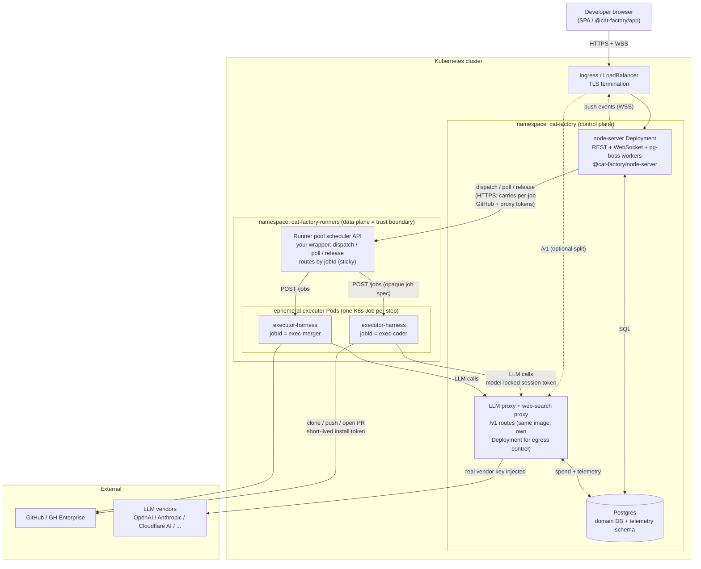
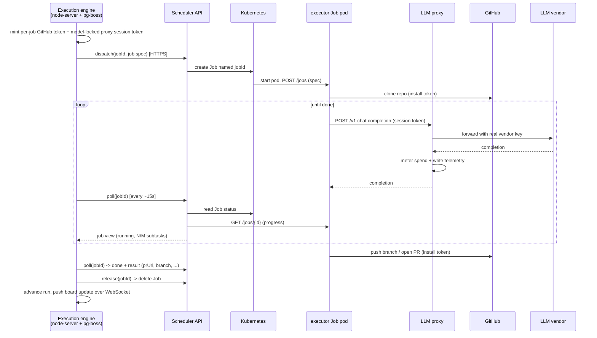

# Running cat-factory on Kubernetes: a possible topology

This describes one sensible way to run the **Node facade** (`@cat-factory/node-server`)
and its agent workload on Kubernetes: where the executor image runs, where the backend
runs, where the proxy the executor talks to the world through lives, and who owns/hosts
what.

It is a reference shape, not the only one. The contracts that constrain it are real (the
runner-pool job protocol, the LLM-proxy egress seam, the SSRF guard on the scheduler URL);
how you lay them out across namespaces, node pools, and managed services is yours to choose.
See [`runner-pool-integration.md`](./runner-pool-integration.md) and
[ADR 0004](./adr/0004-self-hosted-runner-pool.md) for the underlying protocol.

## The pieces

| Component                     | What it is                                                                                                                                                                                                                                          | Lifecycle                                                                                | Who hosts it                                              |
| ----------------------------- | --------------------------------------------------------------------------------------------------------------------------------------------------------------------------------------------------------------------------------------------------- | ---------------------------------------------------------------------------------------- | --------------------------------------------------------- |
| **node-server**               | `@cat-factory/node-server`: the Hono REST API, the WebSocket push transport, and the pg-boss durable-execution workers (the orchestrator).                                                                                                          | Long-lived Deployment, horizontally scalable for the API; pg-boss workers single-or-few. | You, in-cluster.                                          |
| **LLM proxy**                 | The OpenAI-compatible `/v1` egress route the executor points Pi at. Injects the real vendor key (kept out of the container), meters spend, writes telemetry. Lives in the **same** `@cat-factory/server` app, so it ships in the node-server image. | Same as node-server, or a separate Deployment of the same image scoped to egress.        | You, in-cluster.                                          |
| **Postgres**                  | Domain DB + the `telemetry` schema (one connection, two schemas). `migrate()` bootstraps it on boot.                                                                                                                                                | StatefulSet, or a managed service (RDS / Cloud SQL / Neon).                              | You, or your cloud.                                       |
| **Runner pool scheduler API** | Your thin HTTP wrapper the backend calls to `dispatch`/`poll`/`release` a job, so the backend stays out of the Kubernetes API. Optional: the node-server can drive Kubernetes directly instead (see "Who owns / hosts what").                        | Long-lived Deployment (an operator or small web service).                                | You, in-cluster.                                          |
| **executor-harness pods**     | The published `cat-factory-executor` image: clones the repo, runs the Pi coding agent, pushes a branch / opens a PR. Carries **no** secrets; per-job tokens arrive in the dispatch body.                                                            | **Ephemeral** — one K8s Job per pipeline step (`jobId = <executionId>-<agentKind>`).     | You, in-cluster (the trust boundary).                     |
| **SPA**                       | `@cat-factory/app` (the Nuxt layer) built into a static bundle.                                                                                                                                                                                     | Static.                                                                                  | A CDN / object store / nginx pod; out of cluster is fine. |

## Topology

## Who owns / hosts what

- **The control plane** (`namespace: cat-factory`) owns durable state and orchestration:
  the node-server drives the execution engine through pg-boss, persists everything to
  Postgres, and pushes live updates back to the SPA over WebSocket. Scale the API replicas
  freely; pg-boss durable execution is single-process-friendly today (a multi-replica
  worker setup needs Postgres advisory locks / `LISTEN-NOTIFY`, see the realtime note in
  `CLAUDE.md`).

- **The data plane** (`namespace: cat-factory-runners`) is the **trust boundary**. Each
  executor pod receives short-lived per-job credentials in its dispatch body (a GitHub
  installation token and a model-locked LLM-proxy session token) and is otherwise
  secret-free. Run it on its own node pool / namespace with a restrictive
  `NetworkPolicy` so a job pod can reach only the in-cluster proxy and GitHub.

- **The proxy is the only path to model vendors.** Executor pods never hold vendor API
  keys and never call OpenAI/Anthropic/etc. directly. They call the in-cluster `/v1`
  proxy with a session token; the proxy leases the real key, forwards the call, meters
  spend, and records telemetry to Postgres. This is what lets spend safeguards apply to
  jobs running on your own pool. You can keep the proxy as routes on the node-server pods,
  or run it as a separate Deployment of the same image so model egress has its own
  scaling, NetworkPolicy, and egress IP.

- **GitHub is reached directly** by the executor (clone/push/PR), authenticated by the
  per-job installation token. It does not go through the proxy.

- **The scheduler API is an optional layer.** It exists because cat-factory speaks only HTTP
  `dispatch`/`poll`/`release` (described by the JSON manifest you register per workspace), so
  the diagram above factors the Kubernetes translation into a thin wrapper that turns those
  calls into `kubectl`-equivalent ones: `dispatch -> create Job`, `poll -> read Job + harness
  GET /jobs/{id}`, `release -> delete Job`. That wrapper is not mandatory, though. Depending on
  your platform conventions the node-server could talk to the Kubernetes API directly (a
  RunnerTransport that creates/reads/deletes Jobs itself), collapsing the scheduler hop — at
  the cost of giving the control-plane pods cluster API credentials and a Job-spec template
  baked into the deployment rather than a per-workspace manifest. The wrapper keeps that
  cluster access and the spec-building out of the control plane and behind the registrable
  manifest seam, which is why it is the shape shown here. Either way, route by `jobId` stickily
  so a re-dispatch (durable replay) re-attaches instead of duplicating, and use the
  `{{input.instanceType}}` / `{{input.kind}}` manifest variables to pick a node selector,
  resource request, or Job template.

## Request flow for one agent step

## Network and config notes

- **Backend to scheduler is SSRF-guarded.** The manifest `baseUrl` must be public HTTPS by
  default. To keep the scheduler internal (same cluster, no public ingress), widen the
  guard with `RUNNERS_ALLOW_URL_HOSTS` (and `RUNNERS_ALLOW_HTTP_URLS` for plain HTTP). Scope
  the allow-list to exactly the scheduler host.
- **Executor egress** needs: the in-cluster proxy at `${PUBLIC_URL}/v1` for all Pi model
  calls, and GitHub (`github.com` or your Enterprise host). Subscription harnesses
  (Claude Code / Codex) instead reach the vendor API directly with a longer-lived
  credential, so point those steps only at a pool you fully trust.
- **Required backend config** for the agent-job path: a configured GitHub App
  (`GITHUB_APP_ID` / `GITHUB_APP_PRIVATE_KEY`), `PUBLIC_URL` (the proxy base the executor
  is told to call), `AUTH_SESSION_SECRET`, `ENCRYPTION_KEY` (seals the per-workspace
  scheduler secrets at rest; no plaintext fallback), `RUNNERS_ENABLED=true`, and
  `DATABASE_URL`.
- **Watchdogs reap stuck jobs**, not cat-factory: set `JOB_MAX_DURATION_MS` and
  `JOB_INACTIVITY_MS` on the runner pods. `release` is best-effort cleanup; a Job TTL is a
  good backstop.
- **Sizing:** one pool job per pipeline **step**, so a single task run produces several
  short-lived Jobs in sequence. Size the pool for concurrency across workspaces, not one
  job per run.
  </content>
  </invoke>
