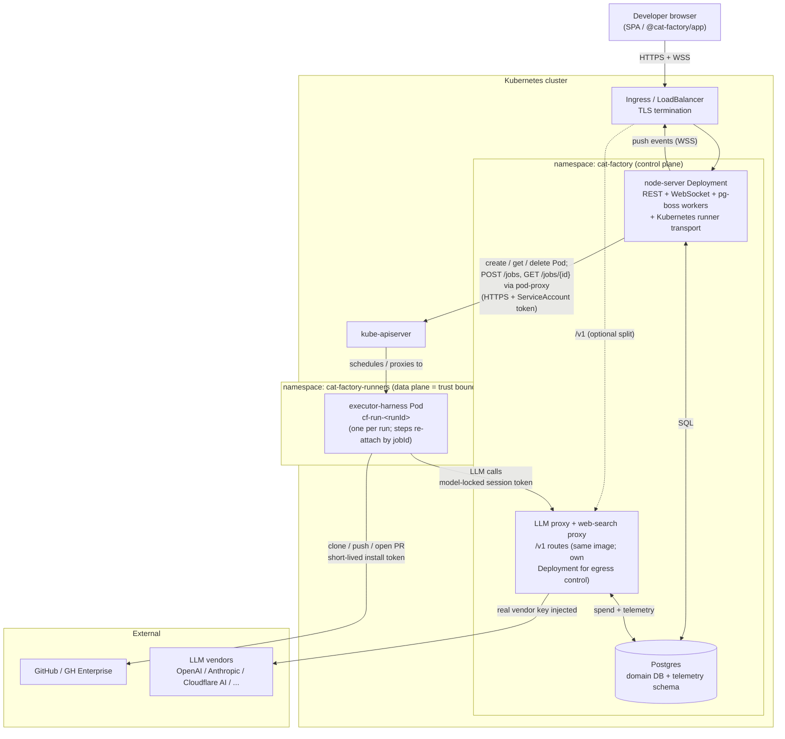
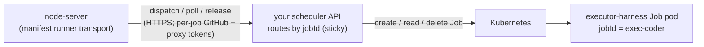

# Running cat-factory on Kubernetes

How to run the **Node facade** (`@cat-factory/node-server`) and its agent workload on
Kubernetes: where the executor image runs, where the backend runs, where the proxy the
executor reaches the world through lives, and who owns/hosts what.

cat-factory's runner backend is pluggable (`registerRunnerBackend`), and on Kubernetes two
backends ship. They differ **only** in how a job is dispatched to a pod; everything else (the
control plane, the data-plane trust boundary, proxy-only model egress, direct-to-GitHub) is
identical.

- **`kubernetes` (recommended).** A native backend that talks to the **kube-apiserver
  directly**: the node-server creates the run pod, reads its status, drives the in-pod harness
  through the apiserver pod-proxy, and deletes the pod when done. Nothing extra to build or run.
- **`manifest` (alternative).** You run a thin HTTP scheduler service that cat-factory calls
  with `dispatch`/`poll`/`release`, and your service translates those into cluster operations.
  Reach for it when you want the apiserver access behind your own service, or when the
  scheduler is not Kubernetes (Nomad, an internal queue).

Start with `kubernetes`. The body of this doc describes that topology; the
[manifest variant](#manifest-variant-byo-scheduler) section at the end covers what changes for
the alternative. See [`runner-pool-integration.md`](./runner-pool-integration.md) and
[ADR 0004](./adr/0004-self-hosted-runner-pool.md) for the registration API and the underlying
job protocol. This is a reference shape: how you lay it out across namespaces, node pools, and
managed services is yours to choose.

## The pieces

| Component                 | What it is                                                                                                                                                                                                                                          | Lifecycle                                                                                                          | Who hosts it                                              |
| ------------------------- | ------------------------------------------------------------------------------------------------------------------------------------------------------------------------------------------------------------------------------------------------------ | ----------------------------------------------------------------------------------------------------------------- | --------------------------------------------------------- |
| **node-server**           | `@cat-factory/node-server`: the Hono REST API, the WebSocket push transport, and the pg-boss durable-execution workers (the orchestrator). With the `kubernetes` backend it also drives the apiserver to create/poll/delete the run pods.            | Long-lived Deployment, horizontally scalable for the API; pg-boss workers single-or-few.                          | You, in-cluster.                                          |
| **LLM proxy**             | The OpenAI-compatible `/v1` egress route the executor points Pi at. Injects the real vendor key (kept out of the container), meters spend, writes telemetry. Lives in the **same** `@cat-factory/server` app, so it ships in the node-server image.  | Same as node-server, or a separate Deployment of the same image scoped to egress.                                 | You, in-cluster.                                          |
| **Postgres**              | Domain DB + the `telemetry` schema (one connection, two schemas). `migrate()` bootstraps it on boot.                                                                                                                                                | StatefulSet, or a managed service (RDS / Cloud SQL / Neon).                                                       | You, or your cloud.                                       |
| **executor-harness pods** | The published `cat-factory-executor` image: clones the repo, runs the Pi coding agent, pushes a branch / opens a PR. Carries **no** secrets; per-job tokens arrive in the dispatch body.                                                            | **Ephemeral** — one bare Pod per RUN (named `cf-run-<runId>`); the run's steps re-attach to it, deleted on release. | You, in-cluster (the trust boundary).                     |
| **SPA**                   | `@cat-factory/app` (the Nuxt layer) built into a static bundle.                                                                                                                                                                                     | Static.                                                                                                            | A CDN / object store / nginx pod; out of cluster is fine. |

## Topology



## Who owns / hosts what

- **The control plane** (`namespace: cat-factory`) owns durable state and orchestration:
  the node-server drives the execution engine through pg-boss, persists everything to
  Postgres, and pushes live updates back to the SPA over WebSocket. With the `kubernetes`
  backend it also holds the apiserver ServiceAccount token (a per-workspace, encrypted secret)
  and the RBAC to manage run pods. Scale the API replicas freely; pg-boss durable execution is
  single-process-friendly today (a multi-replica worker setup needs Postgres advisory locks /
  `LISTEN-NOTIFY`, see the realtime note in `CLAUDE.md`).

- **The data plane** (`namespace: cat-factory-runners`) is the **trust boundary**. Each
  executor pod receives short-lived per-job credentials in its dispatch body (a GitHub
  installation token and a model-locked LLM-proxy session token) and is otherwise
  secret-free. The run pod has **no Service**: it is reachable only through the RBAC-gated
  apiserver pod-proxy, so the harness needs no inbound shared secret. Run it on its own node
  pool / namespace with a restrictive `NetworkPolicy` so a job pod can reach only the
  in-cluster proxy and GitHub.

- **The proxy is the only path to model vendors.** Executor pods never hold vendor API
  keys and never call OpenAI/Anthropic/etc. directly. They call the in-cluster `/v1`
  proxy with a session token; the proxy leases the real key, forwards the call, meters
  spend, and records telemetry to Postgres. This is what lets spend safeguards apply to
  jobs running on your own pool. You can keep the proxy as routes on the node-server pods,
  or run it as a separate Deployment of the same image so model egress has its own
  scaling, NetworkPolicy, and egress IP.

- **GitHub is reached directly** by the executor (clone/push/PR), authenticated by the
  per-job installation token. It does not go through the proxy.

- **How the node-server drives Kubernetes.** On the first step of a run it creates one bare
  Pod named `cf-run-<runId>`; every later step re-attaches (a `POST pods` that returns `409
  AlreadyExists` is treated as an idempotent re-attach), so a run is one pod handling its steps
  in sequence, not a pod per step. Dispatch and poll reach the harness through the apiserver
  **pod-proxy subresource** (`…/pods/<name>:<port>/proxy/…`, harness port `8080` by default);
  `release` deletes the pod. It is a bare Pod, not a Job, because the harness is a long-lived
  HTTP server whose lifecycle we own (create on first dispatch, delete on release) and Job
  completion semantics would fight that. The apiserver URL, namespace, image, resource
  requests/limits, and `nodeSelector`/`tolerations` are all per-workspace config; the
  ServiceAccount token lives in the encrypted secret bundle (`apiToken`).

## Request flow for one agent step

```mermaid
sequenceDiagram
  participant E as Execution engine<br/>(node-server + pg-boss)
  participant A as kube-apiserver
  participant X as executor Pod<br/>cf-run-&lt;runId&gt;
  participant P as LLM proxy
  participant G as GitHub
  participant V as LLM vendor

  E->>E: mint per-job GitHub token + model-locked proxy session token
  E->>A: create Pod cf-run-<runId>  (409 AlreadyExists -> re-attach)
  E->>A: get Pod until Ready
  E->>A: POST /jobs via pod-proxy (job spec + kind)
  A->>X: deliver to harness
  X->>G: clone repo (install token)
  loop until done
    X->>P: POST /v1 chat completion (session token)
    P->>V: forward with real vendor key
    V-->>P: completion
    P->>P: meter spend + write telemetry
    P-->>X: completion
    E->>A: GET /jobs/{jobId} via pod-proxy  [every ~15s]
    A->>X: read progress
    A-->>E: job view (running, N/M subtasks)
  end
  X->>G: push branch / open PR (install token)
  E->>A: GET /jobs/{jobId} -> done + result (prUrl, branch, ...)
  E->>A: delete Pod (release, once the run is done with it)
  E->>E: advance run, push board update over WebSocket
```

The dispatch + poll loop repeats per step against the **same** pod; the pod is deleted only
once the run no longer needs it.

## Network and config notes

- **The apiserver URL is SSRF-guarded but allows private hosts.** `assertApiServerUrlSafe`
  requires `https` and rejects the cloud-metadata endpoints (and their obfuscated IP
  encodings), but a private cluster IP or cluster DNS name is allowed — you are explicitly
  pointing at your own cluster. Paste the cluster CA bundle (`caCertPem`) so the apiserver's
  TLS cert verifies; `insecureSkipTlsVerify` is for kind/dev clusters only. Custom CA /
  insecure-skip needs the Node runtime (undici), so it is rejected at registration on the
  Cloudflare Worker — use a publicly-trusted apiserver certificate to run this backend there.
- **RBAC, not a harness secret, gates access.** The ServiceAccount token needs `create/get/
  delete` on `pods` and `create/get` on `pods/proxy` in the runners namespace. Because the run
  pod has no Service, the RBAC-gated pod-proxy is the only way in.
- **Executor egress** needs: the in-cluster proxy at `${PUBLIC_URL}/v1` for all Pi model
  calls, and GitHub (`github.com` or your Enterprise host). Subscription harnesses
  (Claude Code / Codex) instead reach the vendor API directly with a longer-lived
  credential, so point those steps only at a pool you fully trust.
- **Required backend config** for the agent-job path: a configured GitHub App
  (`GITHUB_APP_ID` / `GITHUB_APP_PRIVATE_KEY`), `PUBLIC_URL` (the proxy base the executor is
  told to call), `AUTH_SESSION_SECRET`, `ENCRYPTION_KEY` (seals the per-workspace runner
  secrets at rest, including the apiserver `apiToken`; no plaintext fallback),
  `RUNNERS_ENABLED=true`, and `DATABASE_URL`.
- **Reaping is on `release` plus a watchdog.** A bare Pod (`restartPolicy: Never`, no owner
  ref / no Job TTL) is **not** garbage-collected, so `release` is the cleanup path and a failed
  release leaks the pod (and its node slot). Set the harness watchdogs `JOB_MAX_DURATION_MS`
  and `JOB_INACTIVITY_MS` on the run pods, and consider a sweeper that deletes pods labelled
  `cat-factory.runId` past a max age as a backstop.
- **Sizing:** one run pod handles a task's pipeline steps in sequence, so concurrency is one
  pod per in-flight run. Size the pool for concurrent runs across workspaces, not one pod per
  step.

## Manifest variant (BYO scheduler)

Choosing the `manifest` backend instead means the node-server **never touches the apiserver**.
It calls your scheduler service over HTTP, and your service performs the cluster operations.
The control plane, proxy egress, trust boundary, and GitHub paths above are unchanged; only the
dispatch hop differs:



- **A scheduler service you build and run** (a small operator or web service) sits between the
  node-server and the cluster. cat-factory speaks only `dispatch`/`poll`/`release` to it,
  described by the JSON manifest you register per workspace; your service maps that to
  `dispatch -> create Job`, `poll -> read Job + harness GET /jobs/{id}`, `release -> delete
  Job`. Route by `jobId` stickily so a re-dispatch (durable replay) re-attaches instead of
  duplicating.
- **One K8s Job per pipeline step** (`jobId = <executionId>-<agentKind>`) is the natural shape
  here, rather than the native backend's one bare Pod per run.
- **The scheduler URL is strictly SSRF-guarded.** The manifest `baseUrl` must be public HTTPS
  by default; to keep the scheduler internal (same cluster, no public ingress) widen the guard
  with `RUNNERS_ALLOW_URL_HOSTS` (and `RUNNERS_ALLOW_HTTP_URLS` for plain HTTP), scoped to
  exactly the scheduler host.
- **A Job TTL is a good reaping backstop** here (you have real Jobs, unlike the native bare
  pods); `release` remains best-effort cleanup. The harness watchdogs `JOB_MAX_DURATION_MS` /
  `JOB_INACTIVITY_MS` still apply on the runner pods.
