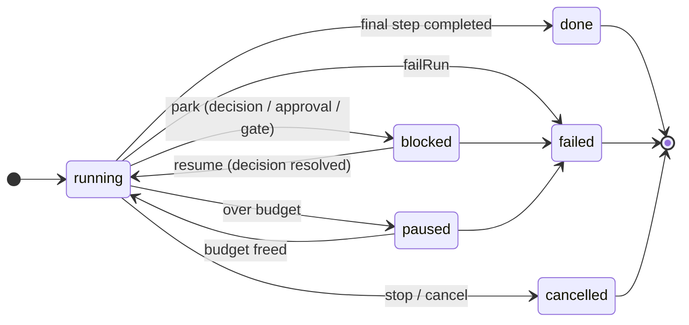
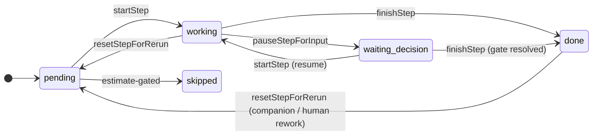

# ExecutionService split — outcome & lifecycle reference

Refactoring candidate **#8** from [`refactoring-candidates.md`](./refactoring-candidates.md):
break the `ExecutionService` god class (originally ~5,016 lines, 67 methods, 46 injected
deps) into cohesive collaborators behind the engine's registry seams, keeping every step
green on the cross-runtime conformance suite (Cloudflare D1 + Node Postgres).

**Status: substantially complete.** Only a cosmetic, opportunistic constructor trim remains
(see "Remaining work"). This doc records the outcome and doubles as the lifecycle reference
(the two state machines + the recorded decision not to adopt XState). The live phase-by-phase
trackers that drove the work have been retired now that it has landed.

## What was done

The split ran in two passes. **Take 1** made the implicit dispatch ordering explicit; **Take 2**
extracted the invariant run/step spine so both file size and per-unit dependency counts dropped.

- **Take 1 — explicit dispatch (Phases 0–5).** Lifted each per-`agentKind` branch of the
  ~290-line `stepInstance` `if`/early-return chain into ordered `StepHandler`s, the
  post-completion ingestion branches into `StepCompletionResolver`s (with a `terminal` vs
  `post-completion` phase discriminator), and the tester/companion verdict short-circuits into
  engine-internal `StepCompletionInterceptor`s. This removed the load-bearing-but-implicit
  ordering hazard and localized the scattered `step.agentKind ===` dispatch checks, but did
  **not** shrink the monolith (the registries + doc comments offset the removed branches).
- **Take 2 — extract the spine (Phases 1–5).** Pulled the invariant lifecycle out of the engine
  into plain-TypeScript collaborators, then re-pointed the variant units at the small surface:
  - **`StepGraph`** (`execution/StepGraph.ts`) — pure, sync step/cursor mutators
    (`startStep` / `finishStep` / `pauseStepForInput` / `resetStepForRerun` + the companion
    rework loop). Only dep is a `Clock`.
  - **`RunStateMachine`** (`execution/RunStateMachine.ts`) — the async instance/block spine:
    `persistInstance` / `emitInstance` (metrics rollup, Kaizen scheduling, terminal personal-
    credential cleanup), block-progress refresh, `parkStepOnDecision` /
    `advancePastResolvedGate`, `finalizeBlock`, `failRun`, `stopRunContainer`, park
    notifications. The merge/auto-start subgraph deliberately stays on the engine.
  - **`RunDispatcher`** (`execution/RunDispatcher.ts`) — the dispatch + completion spine: the
    four registries (step-handler / completion-interceptor / step-resolver / gate) + their
    contexts and caches, the completion hub (`recordStepResult` / `handleAgentStep` /
    `runAgent`), the gate machinery (`evaluateGate` / `dispatchGateHelper` / `pollGate`), the
    deterministic `runDeployer` / `runTracker`, the registered pre/post-op cluster, structured-
    artifact ingest, and the follow-up companion gate + its human-action API. Only **two**
    callbacks cross the boundary (`resolveMergePreset`, `modelIdIsMetered`).
  - The **five gate controllers** (`ReviewGateController`, `CompanionController`,
    `TesterController`, `HumanTestController`, `VisualConfirmationController`) were "debagged"
    — they now take the cohesive `RunStateMachine` + `StepGraph` collaborators instead of
    18-callback bags.
  - **Gate-window sub-facades** (`execution/gate-window-facades.ts`) group the ~30 thin
    parked-gate delegations (requirements/clarity review, brainstorm, human-test, visual-
    confirm) off the engine's public surface; the server controllers call e.g.
    `executionService.humanTest.confirm(...)`.

Net effect: `ExecutionService.ts` went from ~5,346 → **~2,476 lines** (Phase 4 alone moved
~2,140 lines into `RunDispatcher`). Every phase landed as its own commit, green on both
runtimes. The public `ExecutionServiceDependencies` shape is unchanged, so the composition
roots and runtime symmetry were untouched throughout.

The heavier run-control methods (`approveStep` / `rejectStep` / `requestStepChanges` /
`resolveDecision` / `mergePr`, the follow-up actions, `resolveCompanionExceeded`,
`requestHumanReviewFix`) and the merge/auto-start subgraph (`finalizeMerge` /
`applyModuleAssignment` / `autoStartDependents`) were **deliberately left on the engine** —
they carry real state-machine logic and are the core run-control API, not thin delegations.

## Remaining work (deferred, low-value)

- **Finish the Phase 6 constructor trim.** Several deps the engine still stores are now used
  only to *build* `RunDispatcher` / the controllers (the gate/resolver wiring, `issueWriteback`,
  `resolveProviderCapabilities`, …) and could be forwarded directly instead of stored as
  `this.` fields. Others are genuinely shared with stays-on-engine methods
  (`prMerger` / `mergePresetRepository` via `resolveMergePreset` + `mergePr`,
  `environmentProvisioning` via the start gate, `subscriptionActivations` via the start/retry
  gate) and legitimately stay. The remaining trim is **cosmetic** (fewer `this.` fields, same
  inputs), lower-value than the spine extraction, and can be done opportunistically — the
  actual debt (implicit ordering, scattered dispatch checks, fat callback bags) is already gone.

---

# Execution state machine — lifecycle reference

The execution engine drives two small finite state machines. They used to be implicit —
smeared across `ExecutionService` as private mutators and `if (status === …)` checks. The
split above makes them explicit, cohesive plain-TypeScript collaborators: **`StepGraph`** (the
per-step lifecycle) and **`RunStateMachine`** (the per-run lifecycle + the
persist/emit/park/advance/finalize/fail spine).

## Run lifecycle (`ExecutionInstance.status`)

The transitions are driven by the durable driver (Cloudflare Workflows / pg-boss) calling
`advanceInstance` / `pollAgentJob` / `pollGate` in a loop; `RunStateMachine` performs the
status change plus its side effects (persist → emit, finalize the block, signal the driver).

## Step lifecycle (`PipelineStep.state`)

Timestamps are **set-once**: `startedAt` (first `startStep`), `pausedAt` (first
`pauseStepForInput`, cleared on resume/finish), `finishedAt` (`pausedAt ?? now`, so a step
finished out of a park bills its duration to the pause instant). These rules are encoded in
`StepGraph` and must survive a durable replay unchanged.

## Why not XState

A spike modelled both machines in XState v5 as **pure reducers** (the functional
`transition(machine, snapshot, event)` API — no interpreter/actor, so the authoritative state
can still live in the DB and the durable driver stays the runtime). It reproduced the step
lifecycle including the set-once timestamps. So adoption is _feasible_ — but not worthwhile:

- **The authoritative state is durable, persisted and distributed.** The state lives in
  Postgres/D1 (`ExecutionInstance`) and the "interpreter" is Cloudflare Workflows / pg-boss
  across many invocations and machines. That is already our state-machine runtime; XState's
  value is its in-process actor/interpreter/services layer, which we'd discard, keeping only
  the pure reducer.
- **Persisted-shape collision (the real blocker).** The pure API persists/rehydrates XState
  _snapshots_, but our wire/DB shape is `ExecutionInstance` (a `status` string + `steps[]`),
  mirrored across D1 ⇄ Drizzle and pinned by the conformance suite. We'd either migrate the
  persisted schema to store snapshots (a cross-runtime change for zero behavioural gain) or
  hand-map `ExecutionInstance ↔ snapshot` on every load/save — mapping boilerplate that can
  drift, exactly the bug class this refactor removes.
- **The hard parts aren't the chart.** Side-effect ordering (persist → emit), replay
  idempotency, durable park/resume across processes, and registry-driven per-kind dispatch
  (`registerGate` / `registerStepResolver` / `registerAgentKind`, including external packages)
  are all untouched by XState. The charts themselves are tiny (~6 and ~5 states).
- **Friction with no payoff.** `assign` must be pure, so the clock has to be threaded through
  every event payload; most step state (`jobId` / `approval` / `subtasks` / `output` / …)
  isn't FSM state and stays an external side effect anyway; and it adds a dependency to the
  bundle-sensitive runtime-neutral orchestration core.

**Decision: keep the machines as plain TypeScript (`StepGraph` + `RunStateMachine`).** The
benefit people reach for XState for here — a single, legible picture of the lifecycle — is
captured by the Mermaid diagrams above at zero dependency cost.
