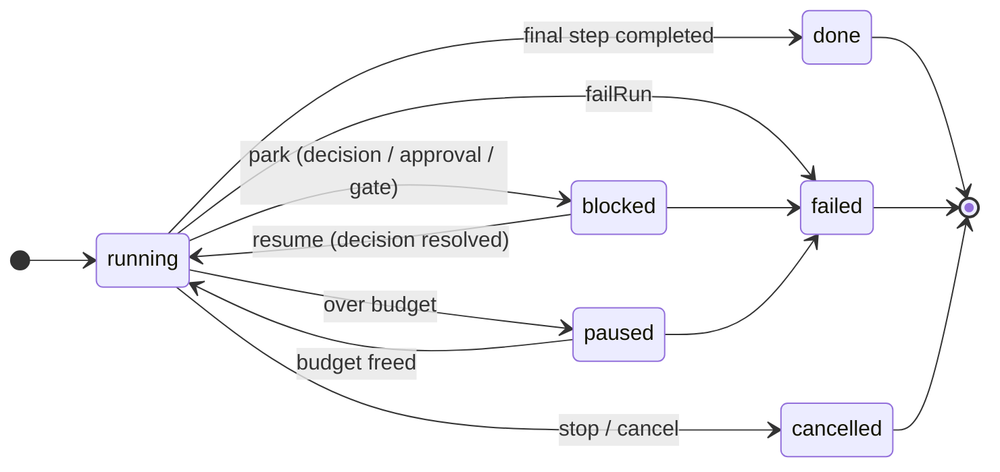
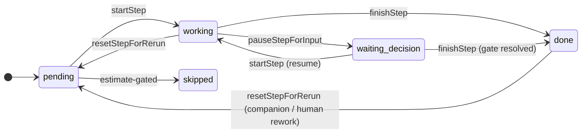

# Execution state machine — lifecycle reference & "why not XState"

The execution engine drives two small finite state machines, made explicit during the
`ExecutionService` split (refactoring candidate #8) as cohesive plain-TypeScript collaborators:
**`StepGraph`** (the per-step lifecycle) and **`RunStateMachine`** (the per-run lifecycle + the
persist/emit/park/advance/finalize/fail spine), both under
`backend/packages/orchestration/src/modules/execution/`. This is the lifecycle reference and the
recorded decision on **not** adopting a state-machine library (XState).

## Run lifecycle (`ExecutionInstance.status`)

The transitions are driven by the durable driver (Cloudflare Workflows / pg-boss) calling
`advanceInstance` / `pollAgentJob` / `pollGate` in a loop; `RunStateMachine` performs the status
change plus its side effects (persist → emit, finalize the block, signal the driver).

## Step lifecycle (`PipelineStep.state`)

Timestamps are **set-once**: `startedAt` (first `startStep`), `pausedAt` (first
`pauseStepForInput`, cleared on resume/finish), `finishedAt` (`pausedAt ?? now`, so a step
finished out of a park bills its duration to the pause instant). These rules are encoded in
`StepGraph` and must survive a durable replay unchanged.

## Why not XState

A spike modelled both machines in XState v5 as **pure reducers** (the functional
`transition(machine, snapshot, event)` API — no interpreter/actor, so the authoritative state
can still live in the DB and the durable driver stays the runtime). It reproduced the step
lifecycle including the set-once timestamps. So adoption is _feasible_ — but not worthwhile:

- **The authoritative state is durable, persisted and distributed.** The state lives in
  Postgres/D1 (`ExecutionInstance`) and the "interpreter" is Cloudflare Workflows / pg-boss
  across many invocations and machines. That is already our state-machine runtime; XState's
  value is its in-process actor/interpreter/services layer, which we'd discard, keeping only the
  pure reducer.
- **Persisted-shape collision (the real blocker).** The pure API persists/rehydrates XState
  _snapshots_, but our wire/DB shape is `ExecutionInstance` (a `status` string + `steps[]`),
  mirrored across D1 ⇄ Drizzle and pinned by the conformance suite. We'd either migrate the
  persisted schema to store snapshots (a cross-runtime change for zero behavioural gain) or
  hand-map `ExecutionInstance ↔ snapshot` on every load/save — mapping boilerplate that can
  drift, exactly the bug class this refactor removes.
- **The hard parts aren't the chart.** Side-effect ordering (persist → emit), replay
  idempotency, durable park/resume across processes, and registry-driven per-kind dispatch
  (`registerGate` / `registerStepResolver` / `registerAgentKind`, including external packages)
  are all untouched by XState. The charts themselves are tiny (~6 and ~5 states).
- **Friction with no payoff.** `assign` must be pure, so the clock has to be threaded through
  every event payload; most step state (`jobId` / `approval` / `subtasks` / `output` / …) isn't
  FSM state and stays an external side effect anyway; and it adds a dependency to the
  bundle-sensitive runtime-neutral orchestration core.

**Decision: keep the machines as plain TypeScript (`StepGraph` + `RunStateMachine`).** The
benefit people reach for XState for here — a single, legible picture of the lifecycle — is
captured by the Mermaid diagrams above at zero dependency cost.
